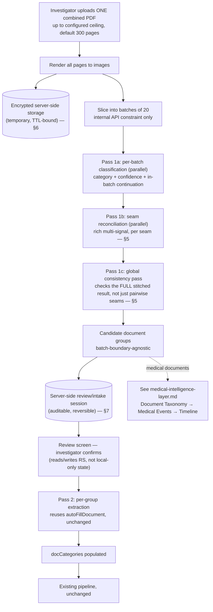

# Document Intake Pipeline — Architecture Assessment

**Status: Proposal, revised twice. Not approved, not implemented, no code written.** Research and design only. Feeds into (does not replace) the frozen [Legal & Investigation Intelligence Engine](../legal-intelligence/README.md).

**This document covers the claim-type-agnostic intake mechanics**: page rendering, batching, classification, boundary reconciliation, storage, and the server-side review/confirm state machine. The Health-Claim-specific medical intelligence modeling (document taxonomy, normalized medical events, the three-tier timeline, treatment/medicine/test/procedure/billing mapping) is now a separate, linked document: **[medical-intelligence-layer.md](medical-intelligence-layer.md)** — split out because it's a distinct concern that only activates for medical-document-heavy claims, while this document's mechanics apply to any bundle regardless of claim type.

**Revision history**: v1 (initial) → v2 (full-bundle batching architecture, mandatory review, 300-page configurable ceiling) → v3 (server-side encrypted storage for page images, a richer multi-signal boundary classifier plus a new global consistency pass, and server-side/auditable review state replacing client-only state) → **v4, this version** (TTL default resolved with an explicit trade-off; Supabase Storage availability verified live against the actual project, not assumed).

## 1. Problem Statement (unchanged from v2)

Upload one combined PDF; the system identifies, groups, classifies, and extracts every document inside it, then populates `docCategories` exactly as manual per-category entry does today. Everything downstream of confirmed documents is either the existing, frozen Legal Intelligence pipeline, or (for medical documents specifically) the new layer described in [medical-intelligence-layer.md](medical-intelligence-layer.md).

## 2. Current System Touchpoints (unchanged from v2)

`DOC_CATEGORIES` (36 categories, `report.html`), `_pdfFileToImages`/`_filesToPayload` (page rendering + the existing 20-image call constraint, `js/ai-service.js`), `AIService.autoFillDocument` (reused unchanged for final extraction). See v2 for full detail — not repeated here.

**New touchpoint identified this revision**: this application has **no existing Supabase Storage usage anywhere** — confirmed by direct grep across `report.html`, `js/app.js`, `js/ai-service.js`. Today, files are read entirely client-side (`FileReader`/`pdfjs`) and their derived image data is sent directly in API request bodies; nothing is ever written to a durable bucket. **Server-side encrypted object storage for page images (§6) is therefore genuinely new infrastructure for this application, not a matter of extending something that already exists.**

**Storage availability — verified live this revision, not just grepped**: `GET https://mqsohzqbsupsathxphgd.supabase.co/storage/v1/bucket`, called with this app's own public anon key (the same key already shipped in `js/app.js` to every browser — not a new credential exposure), returned `HTTP 200` with body `[]`. This confirms the Storage REST service is provisioned and reachable on the actual project (a disabled or unprovisioned Storage add-on would not answer its own API cleanly) and that zero buckets currently exist or are anon-visible — consistent with the grep above at the infrastructure level, not just the code level. **Not verified by this check** — and not verifiable from a static site holding only a public anon key: plan-tier storage quota, and bucket-creation permissions (creating a bucket needs dashboard access or a `service_role`-authenticated call; the anon key cannot and should not be able to create one). See §9 — this narrows the remaining risk to "create and configure one bucket," not "confirm the feature exists."

## 3. Revised Pipeline



## 4. Storage Architecture for Rendered Page Images (new — resolves risk 15.2)

- **Where**: Supabase Storage, a **new, dedicated, private bucket** (e.g. `intake-page-renders`) — no public URL access under any circumstance. Every read goes through an authenticated, signed-URL-or-equivalent path gated by the same Supabase JWT/role check already used everywhere else in this app.
- **What's stored**: only the *rendered derivatives* (per-page JPEG images produced during Pass 1) — not the original uploaded PDF. The original file's handling is explicitly out of scope for this bucket and "remains subject to the application's normal document retention/security policy," per instruction — whatever that policy is today for any other uploaded case file, unchanged by this proposal.
- **Encryption**: at-rest encryption on the bucket (Supabase Storage supports this at the project/infrastructure level) plus the existing in-transit TLS every other call in this app already uses — no new transport mechanism invented.
- **TTL / cleanup — default resolved this revision, still configurable, not hardcoded**: a single flat number forces an artificial choice between "long enough to be useful" and "short enough to be safe," so the default is **tiered by `intake_review_sessions.status` (§6)** rather than one constant:
  - `status IN ('processing', 'ready_for_review')`: **no TTL** — the session is actively using the images; cleanup is gated on reaching a terminal status, not elapsed time.
  - `status = 'confirmed'`: **7 days**. Once confirmed, `autoFillDocument` has already run and `docCategories` is populated — the rendered images are no longer load-bearing for anything except a short grace window (e.g. a QC reviewer double-checking a boundary a few days later). Beyond that, the original PDF (kept under the app's normal, separate retention policy) remains the source of truth for anyone who needs to re-examine a page.
  - `status = 'abandoned'` (or a session that never reaches `confirmed` within a stale-session window): **3 days**. An abandoned upload has no ongoing legitimate use, so its sensitive image copies should clear faster than a confirmed session's grace window.
  - All three numbers are configuration, not constants baked into code — exposed as settings so they can be tuned without a deploy.

  **Trade-off, stated explicitly**: these are rendered images of medical records — sensitive under any reasonable privacy standard, and an *extra* copy of that sensitivity beyond the original document, existing solely to serve a transient UI need (Pass 1 classification + the review screen's "inspect source pages" capability). Shorter TTLs shrink the exposure window if the bucket is ever compromised or misconfigured, at the cost of inconvenience if someone needs to re-open a session after images have already been purged (they fall back to the original PDF, which is slower but not blocked). Longer TTLs trade the reverse. The 7-day/3-day split above leans toward minimizing exposure, consistent with how this document already treats page images as sensitive-and-temporary (this section) rather than durable — but the exact numbers are a policy call for the user to confirm, not a decision to treat as final on the strength of this document alone.
- **Access pattern**: the review screen (§7) fetches page images by reference (a storage path/key stored in the review session record, never the image itself embedded in that record) — keeps the review-session database rows small and keeps image access auditable/gateable independently of the review-session data.

## 5. Boundary Reconciliation — Redesigned (resolves risk 15.3)

**No longer a single last-page/first-page comparison.** Two changes: richer per-seam signal set with a three-way output, and a new pass that checks global consistency across the whole stitched result.

### 5a. Pass 1b — richer per-seam classification

For each batch-to-batch seam, the classifier now considers a **local context window** (a few pages on each side of the seam, not just the two immediately adjacent pages) and reasons over multiple signal types:

- Document headings / titles
- OCR/text continuity (does sentence/paragraph structure carry across the seam)
- Patient / hospital / doctor identity (same names appearing on both sides)
- Dates
- Page numbering (e.g., "3 of 5" → "4 of 5" is strong continuation evidence; a reset to "1 of 1" is strong new-document evidence)
- Repeated headers/footers (letterhead, hospital stamp, form ID)
- Document formatting (layout/template consistency)
- Clinical/content continuity (does the narrative or clinical record logically continue)
- Handwriting/form continuity, where the source is handwritten or a fixed-layout form

**Output**, per seam:
```json
{
  "seamId": "batch3-batch4",
  "verdict": "SAME_DOCUMENT | NEW_DOCUMENT | UNCERTAIN",
  "confidence": "high | medium | low",
  "evidence": [
    { "signal": "page_numbering", "observation": "page reads '4 of 6', following '3 of 6'" },
    { "signal": "heading", "observation": "no new heading detected on the seam page" }
  ]
}
```
`evidence` is what makes this auditable and reviewable, not a black-box verdict — matches the "every observation cites what it's based on" convention already established throughout the Legal Intelligence Engine.

### 5b. Pass 1c — global consistency pass (new)

After all local seam verdicts are in and pages are provisionally stitched into candidate groups, a **separate, lightweight pass examines each resulting candidate group as a whole** — not pairwise — checking for internal contradictions that no single local seam decision would catch on its own: page numbering that doesn't form a coherent sequence across the *whole* group, a document type that drifts (page 3 looks like a lab report, page 15 of the "same" group looks like a discharge summary, even though every seam in between looked locally fine), or an implausible span (a "single document" candidate group spanning 40 pages when nothing else about it suggests a document that large).

**Why this needs to be a separate pass, not folded into 5a**: local seam decisions are necessarily myopic (they only see a small window); a chain of individually-plausible local "continues" verdicts can still produce a globally implausible result — the classic failure mode of purely pairwise/greedy stitching. This pass doesn't re-derive anything from images; it operates on the *already-stitched* candidate groups and their existing per-page classification/confidence data, flagging groups that fail an internal-coherence check for the review screen to surface prominently (not auto-correcting them — correction stays with the investigator, per §7).

## 6. Server-Side Review/Intake Session (new — resolves risk 15.4)

Client-side-only state was rejected: not durable across a session interruption, not auditable, and the earlier "where do in-progress edits live" question (v2 risk 15.4) has no good client-only answer at 300-page scale. New design: a dedicated Supabase table.

```sql
-- illustrative shape, not a migration to run yet
intake_review_sessions
  id                uuid primary key
  draft_id          uuid references report_drafts(id)   -- which report this intake feeds
  user_id           uuid references profiles(id)
  status            text    -- 'processing' | 'ready_for_review' | 'confirmed' | 'abandoned'
  page_count        int
  document_groups   jsonb   -- current state: [{groupId, pageRange, documentTypeId,
                             --   mappedDocCategory, confidence, sourceImageRefs, status}, ...]
  unrecognized_pages jsonb
  edit_log          jsonb   -- append-only: [{timestamp, actor, action, before, after}, ...]
  created_at        timestamptz
  updated_at        timestamptz
  confirmed_at      timestamptz
```

- **`edit_log` is append-only** — every merge/split/retype/reassign action is recorded with a before/after snapshot of the affected group(s), which is what makes edits reversible (undo = apply the inverse of the last log entry) and auditable (a full history survives, not just the final state) — matches the explicit requirement, and mirrors the "never silently overwrite" discipline already used throughout this project (e.g., how document field values are merged, not replaced, during repeat auto-fill).
- **`document_groups`** references page images by storage key (§4), never embeds image data.
- **Nothing writes to `report_drafts.doc_categories` until `status` transitions to `confirmed`** — the same "AI proposes, human confirms" boundary already established for `legal_intelligence`, applied one layer earlier in the pipeline.
- **This is a new table, additive only** — no change to `report_drafts`' existing schema, matching the same non-destructive extension pattern the Legal Intelligence Engine's own registry table established.

## 7. Review Screen — Required Capabilities (unchanged from v2, now backed by §6 instead of client state)

Same 9 capabilities as v2 (review groups, page ranges, document type, confidence, inspect source pages, merge/split, retype, handle unrecognized, explicit confirm) — every read and write now goes through the server-side session (§6) instead of local component state, which is what makes the session resumable and auditable.

## 8. Cost and Performance (updated for Pass 1c)

Unchanged from v2 for Pass 1a/1b scale (15 classification + 14 reconciliation calls at the 300-page ceiling) — Pass 1b's calls are individually somewhat more expensive now (richer context window, structured evidence output) but still `"fast"`-tier and still parallel. **Pass 1c is new but cheap**: it operates on already-extracted classification data, not images — no new vision calls, likely a single reasoning pass (or none at all if implemented as deterministic rule-checks — e.g., page-numbering-sequence validation doesn't need an AI call at all, only genuinely ambiguous coherence questions might).

## 9. Risks Carried Forward and Newly Introduced

| Risk | Status |
|---|---|
| Silent page loss on large bundles | Resolved by design (v2 §5) |
| Misclassified document silently corrupts data | Resolved by design (mandatory review, §7, now server-backed) |
| Locally-plausible-but-globally-wrong stitching | **New, addressed this revision** — Pass 1c (§5b) |
| Page image storage becoming de facto permanent | **Resolved this revision** — tiered default TTL chosen with explicit trade-off (§4: no TTL while active, 7 days confirmed, 3 days abandoned), still configurable |
| New infrastructure dependency (Storage bucket) not yet confirmed available/configured on this Supabase project's plan | **Narrowed this revision** — Storage service confirmed live and reachable via a direct API check against the actual project (§2), zero buckets currently exist. Remaining prerequisite is narrower: creating and configuring the one new bucket (dashboard or `service_role`-authenticated step) and confirming plan-tier quota, neither of which is checkable from a public anon key |
| Investigators bypass review by habit | Unchanged from v2 — UX design concern |

## 10. What This Does Not Change

Unchanged from v2: the Legal Intelligence Engine (registry, contract, all 13 modules, renderer, exports), `AIService`'s existing public methods, `report_drafts`' existing columns. New this revision: also unchanged — the general document retention/security policy for original uploaded files (§4 explicitly scopes storage to *rendered derivatives* only).

---

See [medical-intelligence-layer.md](medical-intelligence-layer.md) for how confirmed documents become normalized medical events, the three-tier timeline model, and the Treatment/Medicine/Test/Procedure/Billing cross-verification layer — including how that layer relates to (and does not replace) the existing Medical Intelligence and Timeline Intelligence modules.

**No code will be written until both documents' open items are addressed or explicitly deferred.**
