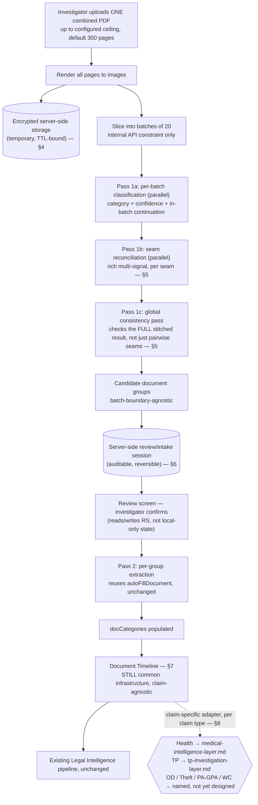

# Document Intake Pipeline — Architecture Assessment

**Status: Proposal, revised four times. Not approved, not implemented, no code written.** Research and design only. Feeds into (does not replace) the frozen [Legal & Investigation Intelligence Engine](../legal-intelligence/README.md).

**This document covers the claim-agnostic common infrastructure**: page rendering, batching, classification, boundary reconciliation, storage, the server-side review/confirm state machine, and the Document Timeline. Everything claim-specific — Health, TP, OD, Theft, and future types — is a separate, linked adapter document built *on top of* this one. See §8 for the formal boundary and the current adapter registry.

**Revision history**: v1 (initial) → v2 (full-bundle batching architecture, mandatory review, 300-page configurable ceiling) → v3 (server-side encrypted storage for page images, a richer multi-signal boundary classifier plus a new global consistency pass, and server-side/auditable review state replacing client-only state) → v4 (TTL default resolved with an explicit trade-off; Supabase Storage availability verified live against the actual project) → v5 (formalized the common-infrastructure/claim-specific-adapter boundary; fixed two places where Health-specific wording had leaked into what's supposed to be generic; relocated Document Timeline here from medical-intelligence-layer.md; generalized the Medical Event persistence design into a shared, adapter-tagged `investigation_events`/`investigation_event_links` pair) → **v6, this version** (closes the 3 REQUIRED BEFORE IMPLEMENTATION items from `FINAL-ARCHITECTURE-AUDIT.md`: restated the 300-page ceiling's explicit rejection behavior in full at §1b rather than a cross-reference that had gone stale; defined export design for adapter-specific timeline views at §8d).

## 1. Problem Statement (unchanged from v2)

Upload one combined PDF; the system identifies, groups, classifies, and extracts every document inside it, then populates `docCategories` exactly as manual per-category entry does today. Everything downstream of confirmed documents is either the existing, frozen Legal Intelligence pipeline, or a claim-specific adapter (§8) for claim types with richer structured content — currently Health and TP.

### 1a. Layering Principle (new this revision — the architectural correction this revision exists to make)

**The Combined PDF pipeline is common infrastructure, built once, used by every claim type.** Page identification, document grouping, cross-batch reconciliation, human review, confirmed documents, provenance, and the Document Timeline (§7) must never branch on claim type and must never assume a specific claim type's document vocabulary. A claim-specific *intelligence* layer — Health's Medical Events, TP's Investigation Events, and future OD/Theft/PA-GPA/WC layers — is built **on top of** confirmed documents, never inside the intake mechanics themselves.

Concretely, the rule this revision enforces: **nothing in §2–§7 below may name a specific claim type, document type, or professional role as if it were universal.** Where earlier revisions of this document did that (§5a's seam signals, §3's diagram), it's fixed below and flagged as a fix, not silently corrected. The test for any future change to this document: would this line still make sense for a Theft claim bundle containing zero medical documents and zero hospitals? If not, it belongs in an adapter document, not here.

This principle was checked against the real codebase, not just stated abstractly — see §2's new finding on `DOC_CATEGORIES`.

### 1b. Page Ceiling Behavior (closes REQUIRED item 1, FINAL-ARCHITECTURE-AUDIT.md §1/§11)

Restated explicitly here because the risk table (§11) previously cited a section number, `(v2 §5)`, that stopped holding this content once the document was renumbered in the layering-separation revision — the behavior itself was never wrong, only no longer stated in the visible text. It is restated in full below, not just cross-referenced, so it can't go stale the same way again:

- **The configured ceiling is initially 300 pages.**
- **The ceiling is configurable** — a setting, not a constant baked into the pipeline logic (same "configuration, not code" discipline already used for the TTL defaults in §4).
- **A PDF exceeding the configured ceiling must be explicitly rejected at upload**, before any rendering or batching begins — a clear, user-facing error naming the actual page count and the configured limit, not a silent partial acceptance.
- **The system must never silently truncate, ignore, or process only the first N pages of an oversized PDF.** There is no code path in this design that reads a subset of pages and proceeds — either the whole bundle is under the ceiling and enters the pipeline, or it's over the ceiling and is rejected outright.
- **The 20-page processing batch (§3 node C) remains an internal processing constraint only**, unrelated to the ceiling — it governs how many pages go into one classification API call, not how many total pages a bundle may contain. A 300-page bundle at a 20-page batch size is 15 batches; a future 500-page ceiling at the same batch size would be 25 batches — the batch size doesn't change with the ceiling.
- **Raising the configured ceiling later is a configuration change, not a pipeline redesign** — grounded, not asserted: nothing in Pass 1a (per-batch), Pass 1b (per-seam), Pass 1c (whole-stitched-result), or the `intake_review_sessions` schema (§6: `page_count int`, `document_groups jsonb`) hardcodes a page or batch count anywhere. Batch count and seam count scale linearly with total pages; raising the ceiling only means more batches get processed for a bundle that's actually that large, and proportionally higher per-upload AI-call cost (§10) — the mechanism itself is unchanged.
- **The invariant that makes "no silent drop" checkable**: every page in a confirmed bundle must appear in exactly one `document_groups[].pageRange` or in `unrecognized_pages` (§6) — never in neither. This is what the review screen (§9) surfaces when it shows "handle unrecognized pages" as a required capability: unrecognized is a visible, actionable state, not pages disappearing.

## 2. Current System Touchpoints (unchanged from v2, extended this revision)

`DOC_CATEGORIES` (36 categories, `report.html`), `_pdfFileToImages`/`_filesToPayload` (page rendering + the existing 20-image call constraint, `js/ai-service.js`), `AIService.autoFillDocument` (reused unchanged for final extraction). See v2 for full detail — not repeated here.

**New finding this revision — `DOC_CATEGORIES` is already largely a TP/MACT taxonomy, not a neutral one.** Direct inspection of all 36 category keys (`report.html:89-362`) shows this application was originally built for MACT/TP investigation, not retrofitted onto a generic document store: `fir`, `spotPanchnama`, `dar`, `siteMap`, `inquestPanchnama`, `pmReport`, `chargesheet`, `otherPolicePapers`, `vehicleRC`, `permit`, `fitness`, `policy`, `pucCert`, `tpVehicle`, `tpInsurance`, `tpRiderDL`, `mcr`, `rtoVerification` are all present today, pre-dating this proposal entirely. This matters for the TP adapter (new [tp-investigation-layer.md](tp-investigation-layer.md)): unlike Health, which needed an entirely new Layer-A taxonomy because nothing like it existed, TP's compatibility map is mostly a near-1:1 identity map onto categories that already exist — the genuinely new work for TP is Layer B (structured, dated investigation events), not Layer A.

**Platform `claim_types` grounding** (`supabase/migrations/20260509000003_multitenant.sql:127-153`) — the real, seeded claim types on this platform today are exactly: `motor_od`, `motor_theft`, `health`, `mact`, `tp`, `non_motor`. Two things worth stating plainly: (1) `report.html`'s own `claimType` dropdown (`["MACT Death Claim","MACT Injury Claim","TPPD Claim"]`) is a separate, hardcoded, narrower list — not sourced from this table — a pre-existing inconsistency this proposal doesn't introduce and isn't in scope to fix here. (2) **PA/GPA and WC, named in the current architecture requirement, do not exist as `claim_types` rows anywhere in this codebase today** — they're named honestly below as future adapters, not implied to already have platform support.

**Storage availability — verified live, not assumed** (unchanged finding from v4): `GET https://mqsohzqbsupsathxphgd.supabase.co/storage/v1/bucket`, called with this app's own public anon key, returned `HTTP 200` with body `[]` — Storage is provisioned and reachable, zero buckets exist yet. Not verifiable from a static site with only an anon key: plan-tier quota, bucket-creation permissions (needs dashboard or `service_role` access). See §11.

## 3. Revised Pipeline



**Fixed this revision**: earlier revisions drew only one dotted branch out of the pipeline, labeled "medical documents," as though Health were the sole specialization and everything else fell through to some implicit default. That was itself a Health-specific assumption leaking into a diagram that's supposed to represent common infrastructure. The corrected diagram shows one adapter fan-out point (§8) with every claim type as a peer.

## 4. Storage Architecture for Rendered Page Images (resolves risk 15.2)

- **Where**: Supabase Storage, a **new, dedicated, private bucket** (e.g. `intake-page-renders`) — no public URL access under any circumstance. Every read goes through an authenticated, signed-URL-or-equivalent path gated by the same Supabase JWT/role check already used everywhere else in this app.
- **What's stored**: only the *rendered derivatives* (per-page JPEG images produced during Pass 1) — not the original uploaded PDF. The original file's handling is explicitly out of scope for this bucket and remains subject to the application's normal document retention/security policy, unchanged by this proposal.
- **Encryption**: at-rest encryption on the bucket (Supabase Storage supports this at the project/infrastructure level) plus the existing in-transit TLS every other call in this app already uses.
- **TTL / cleanup — tiered default, configurable, not hardcoded** (resolved in the prior revision): a single flat number forces an artificial choice between "long enough to be useful" and "short enough to be safe," so the default is tiered by `intake_review_sessions.status` (§6):
  - `status IN ('processing', 'ready_for_review')`: **no TTL** — cleanup is gated on reaching a terminal status, not elapsed time.
  - `status = 'confirmed'`: **7 days** — a short grace window after `docCategories`/adapter events are already populated; the original document remains the durable source of truth beyond that.
  - `status = 'abandoned'`: **3 days** — no ongoing legitimate use, so exposure should clear faster.
  - **Trade-off**: rendered page images are an *extra* copy of sensitive document content (medical or otherwise — a TP bundle's MLC/postmortem pages are just as sensitive as a Health bundle's) existing solely for a transient UI need. Shorter TTLs shrink exposure if the bucket is ever compromised or misconfigured, at the cost of needing to fall back to the original PDF if someone reopens a session after images expire. These numbers lean toward minimizing exposure but are a policy call for the user to confirm, not final on the strength of this document alone.
- **Access pattern**: the review screen (§9) fetches page images by reference (a storage path/key stored in the review session record, never the image itself embedded in that record).

## 5. Boundary Reconciliation — Redesigned (resolves risk 15.3)

**No longer a single last-page/first-page comparison.** Two changes: richer per-seam signal set with a three-way output, and a new pass that checks global consistency across the whole stitched result.

### 5a. Pass 1b — richer per-seam classification

For each batch-to-batch seam, the classifier considers a **local context window** (a few pages on each side of the seam, not just the two immediately adjacent pages) and reasons over multiple signal types:

- Document headings / titles
- OCR/text continuity (does sentence/paragraph structure carry across the seam)
- **Named-entity identity** (same person or organization named on both sides — e.g. claimant, patient, driver, doctor, hospital, police station, insurer; *fixed this revision — previously read "Patient / hospital / doctor identity," a Health-only example presented as if it were the general signal*)
- Dates
- Page numbering (e.g., "3 of 5" → "4 of 5" is strong continuation evidence; a reset to "1 of 1" is strong new-document evidence)
- Repeated headers/footers (letterhead, hospital stamp, police-station seal, form ID)
- Document formatting (layout/template consistency)
- **Narrative/content continuity** (does the record's subject-matter narrative logically continue — clinical, investigative, procedural, or otherwise; *fixed this revision — previously read "Clinical/content continuity," again a Health-only framing of a general signal*)
- Handwriting/form continuity, where the source is handwritten or a fixed-layout form

**Output**, per seam:
```json
{
  "seamId": "batch3-batch4",
  "verdict": "SAME_DOCUMENT | NEW_DOCUMENT | UNCERTAIN",
  "confidence": "high | medium | low",
  "evidence": [
    { "signal": "page_numbering", "observation": "page reads '4 of 6', following '3 of 6'" },
    { "signal": "heading", "observation": "no new heading detected on the seam page" }
  ]
}
```
`evidence` is what makes this auditable and reviewable, not a black-box verdict.

### 5b. Pass 1c — global consistency pass

After all local seam verdicts are in and pages are provisionally stitched into candidate groups, a **separate, lightweight pass examines each resulting candidate group as a whole** — not pairwise — checking for internal contradictions no single local seam decision would catch: page numbering that doesn't form a coherent sequence across the *whole* group, a document type that drifts partway through, or an implausible span. This pass doesn't re-derive anything from images; it operates on already-stitched candidate groups and their existing per-page data, flagging groups that fail an internal-coherence check for the review screen to surface (correction stays with the investigator, per §9).

## 6. Server-Side Review/Intake Session (resolves risk 15.4)

```sql
-- illustrative shape, not a migration to run yet
intake_review_sessions
  id                uuid primary key
  draft_id          uuid references report_drafts(id)   -- which report this intake feeds
  user_id           uuid references profiles(id)
  status            text    -- 'processing' | 'ready_for_review' | 'confirmed' | 'abandoned'
  page_count        int
  document_groups   jsonb   -- [{groupId, pageRange, documentTypeId,
                             --   mappedDocCategory, confidence, sourceImageRefs, status}, ...]
                             -- documentTypeId/mappedDocCategory are free-form strings — this table
                             -- has never named a claim type or document taxonomy; no fix was needed here.
  unrecognized_pages jsonb
  edit_log          jsonb   -- append-only: [{timestamp, actor, action, before, after}, ...]
  created_at        timestamptz
  updated_at        timestamptz
  confirmed_at      timestamptz
```

- **`edit_log` is append-only** — every merge/split/retype/reassign action is recorded with a before/after snapshot, making edits reversible and auditable — matches the "never silently overwrite" discipline already used throughout this project.
- **Nothing writes to `report_drafts.doc_categories` until `status` transitions to `confirmed`** — the same "AI proposes, human confirms" boundary already established for `legal_intelligence`.
- **Additive only** — no change to `report_drafts`' existing schema.

## 7. Document Timeline (relocated here this revision — common infrastructure, not a Health specialization)

**This section previously lived in `medical-intelligence-layer.md` as its §4a.** On inspection it was already fully claim-agnostic — nothing about "confirmed documents ordered by their own date" is medical — so keeping it filed under a Health-specific document was the same category of error as §5a's leaked signal names, just structural instead of textual. It's common infrastructure and now lives here.

**Definition**: confirmed document *groups* (from §6, once `status = 'confirmed'`), ordered by each document's own date (e.g. an FIR dated 12/03, a chargesheet dated 30/04, a discharge summary dated 22/03 — mixed claim content, one timeline). Coarse — one point per document, not per extracted fact. This is the last common-infrastructure artifact before a claim-specific adapter takes over: every adapter (§8) receives the Document Timeline as one of its inputs and builds a finer-grained, claim-specific timeline on top of it (Health's Medical Event Timeline / Patient Treatment Timeline; TP's Investigation Event Timeline) — the common layer never builds that finer timeline itself, since doing so would require knowing what "finer" means for a given claim type.

## 8. Claim-Specific Adapter Contract & Registry (new this revision)

### 8a. The Contract

What crosses from common infrastructure into a claim-specific adapter, and nothing more:
- Confirmed document groups (§6, post-`confirmed`): `{groupId, pageRange, documentTypeId, mappedDocCategory, sourceImageRefs}`.
- Provenance for every group: which pages, at what confidence, from which seam/consistency decisions.
- The Document Timeline (§7).

What an adapter must never assume about the common layer, and what the common layer must never assume about an adapter — this is the enforcement mechanism for §1a's layering principle, not just a statement of intent:
- The common layer (§2–§7) never imports, names, or special-cases an adapter's document taxonomy or event vocabulary.
- An adapter never modifies §2–§7's behavior, schema, or classification logic — it only *reads* confirmed output and *writes* its own structured events (below).
- A bundle with zero documents relevant to any adapter (e.g. a claim type with no adapter built yet) still passes through §2–§7 unchanged and lands in the existing, frozen Legal Intelligence pipeline exactly as it does today.

### 8b. Shared Persistence — `investigation_events` / `investigation_event_links`

**Generalized this revision from the prior round's Health-only `medical_events`/`medical_event_links`.** Building a second adapter (TP) with its own duplicate pair of tables would be exactly the duplication this revision's instruction rules out — the event/relationship shape isn't Health-specific, only the *vocabulary* populating it is. One shared schema, tagged by which adapter produced each row:

```sql
-- illustrative shape, not a migration to run yet

investigation_events
  id                     uuid primary key
  draft_id               uuid references report_drafts(id)
  review_session_id      uuid references intake_review_sessions(id)   -- nullable
  source_adapter         text     -- 'health' | 'tp' | 'od' | 'theft' | ... — the ONE claim-aware
                                   -- column in this table; see §8c for the adapter registry
  event_type             text     -- adapter-defined vocabulary; a shared base set (e.g. billingItem)
                                   -- plus adapter-specific extensions — see each adapter document
  description            text
  event_date              text    -- preserved as written in source, never reformatted
  event_time               text   -- nullable
  actor                     text  -- generalized from a prior Health-only 'doctor' field — a doctor
                                   -- for Health, an investigating officer/witness/party for TP
  location                  text  -- generalized from a prior Health-only 'facility' field — a
                                   -- hospital for Health, a police station/court/site for TP
  status_note                text -- nullable free-text status/progress at time of event (renamed
                                   -- from a prior Health-only 'clinicalStatus' — e.g. "stable" for
                                   -- Health, "chargesheet filed" for TP)
  amount                      numeric  -- nullable
  source_document_group_id     text    -- references document_groups[].groupId (§6) — a value
                                        -- reference, not a DB-level FK (that data lives in jsonb)
  source_pages                  int[]  -- plural — one fact can span/repeat across multiple pages
  confidence                     text  -- 'high' | 'medium' | 'low'
  extraction_status                text -- 'extracted' | 'investigator_confirmed'
                                         -- | 'investigator_edited' | 'investigator_rejected'
  superseded_by                     uuid references investigation_events(id)  -- nullable;
                                         -- corrections create a new row rather than mutating in place
  created_at, updated_at               timestamptz
  created_by                            uuid references profiles(id)

investigation_event_links
  id                 uuid primary key
  draft_id           uuid references report_drafts(id)   -- denormalized for RLS simplicity
  from_event_id      uuid references investigation_events(id)
  to_event_id        uuid references investigation_events(id)
  relationship_type  text  -- adapter-defined vocabulary — see each adapter document
  confidence         text  -- independent of either endpoint event's own confidence
  evidence           text  -- nullable; why this link was drawn
  created_at         timestamptz
```

- **Auditability**: `extraction_status` + `superseded_by` gives a checkable history without a separate log table — an event's current state is always one row, its history is the chain of `superseded_by` pointers.
- **RLS**: same `SECURITY DEFINER` helper pattern already used for every table in this project, scoped by `draft_id → report_drafts.user_id`.
- **Additive only**: two new tables; zero changes to `report_drafts`, `intake_review_sessions`, or any existing table.

### 8c. Adapter Registry (new — mirrors the `legal_intelligence_modules` registry pattern already proven in this project)

A lightweight registry table, `claim_intelligence_adapters`, the same pattern already trusted for the 13-module Legal Intelligence registry — a list of adapters with status, not a hardcoded if/else on claim type anywhere in code:

```sql
-- illustrative shape, not a migration to run yet
claim_intelligence_adapters
  id            text primary key   -- 'health' | 'tp' | 'od' | 'theft' | 'pa_gpa' | 'wc'
  label         text
  status        text   -- 'designed' | 'named' | 'future'
  spec_doc      text   -- path to the adapter document, if one exists
```

| `id` | Label | Status | Document |
|---|---|---|---|
| `health` | Health Claim Medical Intelligence | Designed | [medical-intelligence-layer.md](medical-intelligence-layer.md) |
| `tp` | TP Investigation Intelligence | Designed (this revision) | [tp-investigation-layer.md](tp-investigation-layer.md) — also covers `mact` claims, which share the same FIR/Panchnama/MLC/chargesheet document universe as `tp` |
| `od` | OD Damage/Repair/Assessment/Billing Intelligence | Named, not yet designed | — |
| `theft` | Theft Timeline + Vehicle Recovery/Police/Documentary Verification | Named, not yet designed | — |
| `pa_gpa` | PA/GPA Intelligence | Future — **not a `claim_types` row on this platform today** (§2) | — |
| `wc` | Workmen's Compensation Intelligence | Future — **not a `claim_types` row on this platform today** (§2) | — |

`od` and `theft` map onto the platform's real `motor_od`/`motor_theft` claim types (§2) and are genuinely next in line if this proposal proceeds past Health/TP; `pa_gpa`/`wc` are named because the requirement named them, not because platform support exists yet — building their adapters is also blocked on those claim types existing at all.

### 8d. Export Design for Adapter-Specific Views (new — closes REQUIRED item 3, FINAL-ARCHITECTURE-AUDIT.md §8/§11)

**Architecture-level design only — no export code is written or changed by this section.** Applies generically to any adapter's dedicated timeline view (Health's Patient Treatment Timeline, TP's Investigation Timeline, and any future adapter's equivalent) — one export pattern, not one per adapter, same "define once, adapters populate it" discipline as the rest of §8.

**Placement**: an additional subsection within the existing Legal & Investigation Intelligence export block — after the 13-module checklist, still before the disclaimer footer, the same anchor point established for that section originally. One appendix-style intelligence area in the exported document, not a scattered new section.

**Appears only when populated** — same discipline as the 13-module checklist's own "Not Performed" rows: if no adapter has produced events for this draft (claim type has no adapter, or the adapter hasn't run yet), its timeline subsection is omitted entirely, not shown as an empty placeholder. A court-facing export should never show fabricated structure behind data that doesn't exist.

**Row shape — one row per event, chronological**:

| Column | Source | Notes |
|---|---|---|
| Date/time | `event_date`/`event_time` | preserved as written in source, never reformatted — same convention as every existing export |
| Stage | `event_type`, rendered via the adapter's display label (e.g. "Admission," "Diagnosis," not the raw enum value) | |
| Description | `description` | |
| Source | `source_document_group_id` + `source_pages`, rendered as a group/page reference (e.g. "Discharge Summary, p.14") | shown **where appropriate** — omitted, never fabricated, for a row whose provenance genuinely wasn't captured |
| Confidence | `confidence` | shown **where appropriate** — a uniformly `high`-confidence set of rows doesn't need every row visually flagged, but any `low`-confidence row should be visually distinguishable, mirroring how the existing Legal Intelligence renderer already color-codes status |

**Relevant findings**: discrepancy/verification records (medical-intelligence-layer.md §5, tp-investigation-layer.md §5) render as a distinct list beneath the chronological table, each citing the `relatedEventIds` it concerns — the same "every observation names its source" discipline already used throughout every existing export in this app.

**Format-specific rendering** (design intent, not implementation):
- Word/PDF: a formatted table per adapter subsection, styled consistently with how `ModuleCard`s already render structured module data in `report.html`'s existing `LegalIntelligenceSection` — no new visual language invented.
- Text export: a flat, indented list per event (`date — stage — description — source — confidence`), mirroring the plain-text export's existing, simpler treatment of the 13-module checklist.

**What this does not do**: does not add new fields to the 13-module `ModuleRecord` contract; does not change `downloadAsWord`/`downloadAsPDF`/`downloadAsText`'s existing behavior for any of the 13 Legal Intelligence modules — this is a new, additional subsection those functions would need to gain, not a modification of what they already render. Building it is scoped to Phase 5 of the recommended implementation sequence (FINAL-ARCHITECTURE-AUDIT.md §12), not this documentation round.

## 9. Review Screen — Required Capabilities (unchanged from v2, backed by §6)

Same 9 capabilities as v2 (review groups, page ranges, document type, confidence, inspect source pages, merge/split, retype, handle unrecognized, explicit confirm) — every read and write goes through the server-side session (§6).

## 10. Cost and Performance (unchanged from v3)

15 classification + 14 reconciliation calls at the 300-page ceiling, all `"fast"`-tier and parallel. Pass 1c operates on already-extracted classification data, not images — no new vision calls, likely a single reasoning pass or none at all for deterministic checks (e.g. page-numbering-sequence validation).

## 11. Risks Carried Forward and Newly Introduced

| Risk | Status |
|---|---|
| Silent page loss on large bundles | Resolved by design — explicit rejection + page-accounting invariant (§1b; *this row previously cited a stale `v2 §5` reference that no longer held the content after renumbering — fixed by restating the behavior explicitly rather than cross-referencing it*) |
| Misclassified document silently corrupts data | Resolved by design (mandatory review, §9, server-backed) |
| Locally-plausible-but-globally-wrong stitching | Resolved by design — Pass 1c (§5b) |
| Page image storage becoming de facto permanent | Resolved — tiered default TTL with explicit trade-off (§4) |
| Storage bucket availability | Narrowed — service confirmed live via direct API check (§2); remaining prerequisite is creating and configuring the one bucket |
| **Common infrastructure silently absorbing claim-specific assumptions** | **New this revision, and now the reason this revision exists** — found and fixed twice already (§3, §5a); the test in §1a is the ongoing mitigation, not a one-time fix |
| **A future adapter needing schema changes to §6/§8b that the other adapters don't need** | **New** — not yet tested against a third adapter (only Health and TP exist in any detail so far); OD/Theft will be the real test of whether `investigation_events`' generalized shape actually holds, or needs revisiting |
| Investigators bypass review by habit | Unchanged — UX design concern |

## 12. What This Does Not Change

The Legal Intelligence Engine (registry, contract, all 13 modules, renderer, exports), `AIService`'s existing public methods, `report_drafts`' existing columns, the general document retention/security policy for original uploaded files.

---

Claim-specific adapters: [medical-intelligence-layer.md](medical-intelligence-layer.md) (Health) and [tp-investigation-layer.md](tp-investigation-layer.md) (TP) — both build on §7's Document Timeline and write into §8b's shared `investigation_events`/`investigation_event_links`, tagged by `source_adapter`. Neither modifies this document's common-infrastructure sections.

**No code will be written until this document's and both adapter documents' open items are addressed or explicitly deferred.**
