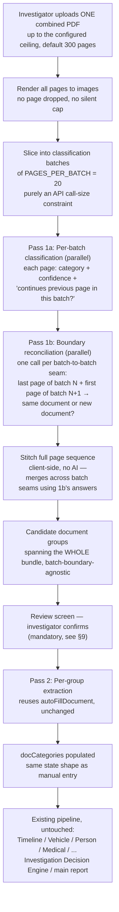

# Document Intake Pipeline — Architecture Assessment

**Status: Proposal, revised after decisions on §14 (original). Not approved, not implemented, no code written.** This document is research and design only. It feeds into (does not replace) the frozen [Legal & Investigation Intelligence Engine](../legal-intelligence/README.md) — everything from "Chronological timeline" onward in the proposed pipeline already exists and is untouched by anything in this document.

**Revision note**: this version reflects three explicit decisions — (1) architect for full bundle size from day one, batching is an internal processing detail only, page boundaries must not fragment a document; (2) mandatory review/confirm screen, with a specific required capability list; (3) a 300-page **configurable** ceiling, no silent truncation beyond it. §5, §6, §7, §9, and §13 are substantially rewritten. §14 (original) is resolved and archived at the bottom; a new §15 lists what's still open.

## 1. Problem Statement

**Today**: an investigator manually ticks each of **36 document categories** in `report.html`, and per category either types values directly or clicks "Upload to auto-fill" to extract fields from files scoped to *that one category*.

**Proposed**: upload **one combined PDF** — realistically, for a Health Claim, the patient's complete treatment paper bundle, admission through discharge (or through the current date, for ongoing treatment) — and have the system identify, group, classify, and extract every document inside it, then populate `docCategories` exactly as manual entry does today.

**Target workflow (as specified)**:
```
ONE COMBINED PDF
  → Page/Document Identification
  → Document Grouping
  → Date/Entity Extraction
  → Complete Medical Timeline
  → Treatment/Medicine/Test/Procedure/Billing Cross-Verification
  → Discrepancies/Red Flags
  → Investigation Summary
```

Everything from "Complete Medical Timeline" onward is served by the **existing, frozen** Legal Intelligence pipeline (Timeline Intelligence; the checks/discrepancies modules including Medical Intelligence; Investigator Alerts/Risk Assessment; the Investigation Decision Engine) — confirmed explicitly by your Q2 answer: *"the existing `docCategories` and downstream intelligence pipeline should be used without replacing those existing modules."* This document only concerns what fills `docCategories`, not anything that reads from it. **One open question this raises is flagged in §15.1** — the granularity "Treatment/Medicine/Test/Procedure/Billing Cross-Verification" implies is a genuinely new question worth surfacing, not silently assumed either way.

## 2. Current System Touchpoints (unchanged from original assessment)

| Existing piece | Location | Relevance |
|---|---|---|
| `DOC_CATEGORIES` | `report.html` | 36 categories — the classification target set (see §15.1 for whether this set needs extension for Health Claims specifically). |
| `_pdfFileToImages(file)` | `js/ai-service.js` | PDF → JPEG image array. Today silently caps at 20 pages/file — this constraint is being **eliminated as a product limit** and repurposed as an internal batch size (§5). |
| `_filesToPayload(files)` | `js/ai-service.js` | Throws above 20 combined images or ~18MB — same repurposing applies. |
| `_buildDocumentAutoFillPrompt(category, textBlock)` / `AIService.autoFillDocument` | `js/ai-service.js` | Per-category extraction — reused unchanged for Pass 2 (§4). |

Nothing above changes in behavior for the existing single-category upload path — this proposal adds a new, separate entry point.

## 3. The Page-Count Constraint — Reframed Per Your Decision

Original framing treated 20 pages as a hard product ceiling to work around. **That's now explicitly wrong per your Q1 answer**: batching is purely how the system talks to the vision API internally; it must never determine where one document ends and another begins. A document spanning pages 18–23 must be recognized as one document even if pages 18–20 and 21–23 are processed in two different API calls. §5 is the design for this.

## 4. Revised Pipeline



Stage-by-stage:

1. **Render all pages.** Every page in the bundle, up to the configured ceiling (§5) — never truncated.
2. **Slice into batches of `PAGES_PER_BATCH` (20).** Purely a call-size constraint, matching the existing vision-endpoint limit already used elsewhere in this codebase — not a semantic boundary.
3. **Pass 1a — per-batch classification, run in parallel** (`Promise.all`, the same pattern already proven for the 9 Legal Intelligence modules — latency tracks the slowest batch, not the sum). For each page in a batch: category (of the 36, or "Unrecognized"), confidence, and whether it continues the previous page *within the same batch*.
4. **Pass 1b — boundary reconciliation, also run in parallel.** For each of the (batch count − 1) seams between batches, one small, cheap call comparing only the last page-image of batch N and the first page-image of batch N+1: "same document, continued, or genuinely a new document?" This is what makes batching invisible to document grouping — it specifically resolves the one case Pass 1a cannot see (a document that happens to straddle a batch seam).
5. **Stitch, client-side, no AI.** Walk the full page sequence in order; use Pass 1a's within-batch continuation signal at every non-seam transition, and Pass 1b's answer at every seam. The result is a list of document groups (page ranges) that is **completely independent of where batch boundaries fell** — the architectural requirement from your Q1 answer.
6. **Review screen** (§9) — mandatory, per Q2.
7. **Pass 2 — per-group extraction.** Unchanged from the original proposal: reuses `AIService.autoFillDocument` once per confirmed group.
8. **Populate `docCategories`**, unchanged.
9. **Existing pipeline consumes it**, unchanged — confirmed as a hard constraint by your Q2 answer.

## 5. Batching Architecture (redesigned per Q1)

- **`PAGES_PER_BATCH = 20`** — an internal constant, not a document-size limit. Matches the existing vision-call constraint already in `_filesToPayload`, so Pass 1a reuses that exact limit rather than inventing a new one.
- **`MAX_BUNDLE_PAGES`** — a **configurable** ceiling, default **300** (per your Q3 answer). Lives as a named config value, not a literal scattered through the code, specifically so raising it later is a config change, not a redesign — this is the point of designing the batching/stitching logic (§4 steps 2–5) to be page-count-agnostic from the start.
- **Above `MAX_BUNDLE_PAGES`**: explicit rejection before any processing begins — "This bundle has N pages; the configured maximum is 300. Please split it into two uploads." No partial processing, no silent truncation, matching the existing `_filesToPayload` pattern of failing loudly on oversized input rather than guessing.
- **Why parallel batches + a separate reconciliation pass, not sequential batches carrying context forward**: a sequential design (each batch call informed by the previous one) would force Pass 1a's latency to be the *sum* of all batch latencies. The parallel-plus-reconciliation design keeps Pass 1a's latency at roughly the *slowest single batch*, and adds a second, also-parallel, cheap (2-image, simple-question) reconciliation pass — consistent with how `getLegalIntelligence()` already treats latency in this codebase, and cheaper in aggregate than re-sending overlap pages into every batch call.
- **Concrete scale at the new 300-page ceiling**: 300 ÷ 20 = 15 classification batches (parallel) + 14 boundary-reconciliation calls (parallel) = 29 total vision calls for Pass 1, before Pass 2 (extraction, unchanged cost profile from today) begins.

## 6. Technical Approach — Options Reconsidered

| Option | Description | Verdict |
|---|---|---|
| **A — Parallel batch classification + boundary reconciliation** (§4, §5) | As above. | **Recommended, revised from the original assessment's simpler "Option A."** Directly satisfies the cross-batch continuity requirement. |
| **A′ — Sequential batches with carried overlap page** | Each batch resends the previous batch's last page as context. | Considered and set aside in favor of A — strictly worse latency (sequential dependency) for no accuracy benefit over the parallel reconciliation design. |
| **B — OCR-first, text classification** | Unchanged from original — still a Phase-2-or-later cost optimization, not a Phase 1 concern. | Deferred, not rejected. |
| **C — Fully automatic, no review screen** | Skip investigator confirmation. | **Rejected, reaffirmed by your Q2 answer.** Explicitly: *"a wrong page boundary or wrong document classification can contaminate all downstream intelligence."* |

## 7. Cost and Performance Estimate (revised for 300-page ceiling)

- **Pass 1a (classification)**: 15 parallel batches, `model_tier: "fast"`, small per-page output.
- **Pass 1b (reconciliation)**: 14 parallel calls, 2 images each, a single yes/no-plus-category question — the cheapest call type in this entire pipeline.
- **Pass 2 (extraction)**: one call per confirmed group (likely 15–30 groups for a large Health Claim bundle) — **identical cost profile to today's manual per-category "Upload to auto-fill,"** just triggered automatically.
- **Net new cost vs. the original assessment**: Pass 1b is new; it's a small addition (14 cheap calls at 300 pages) on top of Pass 1a, which was already accounted for.
- **Latency**: Pass 1a and 1b are each internally parallel; total time-to-review-screen ≈ (slowest Pass 1a batch) + (slowest Pass 1b reconciliation), not a sum across 29 calls — expect well under a minute even at the 300-page ceiling, before Pass 2 (which only runs after investigator confirmation) begins.

## 8. Error Handling and Ambiguous Cases (unchanged, plus one addition)

Original cases (unrecognized page, low-confidence boundary, repeated category, ceiling exceeded, illegible page) all still apply. **New, specific to the batching redesign**:

- **Boundary reconciliation itself returns low confidence** (Pass 1b genuinely can't tell if two pages are one document or two) — surfaced explicitly in the review screen at that specific page, not silently resolved either direction. This is the one new failure mode the parallel-plus-reconciliation design introduces, and it must be visible, not defaulted.

## 9. Review Screen — Required Capabilities (per Q2, verbatim requirements)

Mandatory, blocking — nothing reaches `docCategories` without explicit confirmation here. Required capabilities, as specified:

1. **Review identified document groups** — the full list, not a summary.
2. **See page ranges** per group.
3. **See document type** (proposed category) per group.
4. **See confidence** per group (and per flagged boundary, per §8).
5. **Inspect the source pages** — the actual page images, not just metadata. This is a real UI/storage requirement: rendered page images from Pass 1a must be retained (at least for the session) so the investigator can look at what the system looked at, not just read its conclusion.
6. **Merge/split groups** — correct a boundary the system got wrong in either direction.
7. **Change the document type** — correct a misclassification without needing to redo grouping.
8. **Handle unrecognized pages** — explicit assignment or exclusion, never silently dropped or force-fit.
9. **Explicitly confirm/commit** — the action that triggers Pass 2 and only then touches `docCategories`.

After commit: unchanged from the original proposal — Pass 2 reuses `autoFillDocument` per group, `docCategories` is populated exactly as manual entry produces it, and the existing Legal Intelligence pipeline runs exactly as it does today.

## 10–12. What This Does Not Change / What's Genuinely New / Risks

Unchanged from the original assessment **except**:
- §11 ("what's genuinely new") now includes: the Pass 1b boundary-reconciliation prompt/call, the client-side stitching function (§4 step 5), and page-image retention for the review screen (§9 item 5) — this last one is a real, new *storage* consideration (even if session-scoped/temporary) that the original assessment didn't need to address at 20-page scale.
- §12 ("risks") — the "silent page loss" risk is now resolved by design (§5) rather than mitigated; a new risk is added below (§15.2, page-image storage volume at 300-page scale).

## 13. Phased Approach — Revised Per Q1

**The original three-phase plan (20-page MVP first) is withdrawn.** Per your instruction: *"Do not build a 20-page-only MVP that later needs architectural rework for larger bundles."* Revised:

1. **Phase 1 — Build the full architecture (§4–§9), validate incrementally.** The batching/reconciliation/stitching design is page-count-agnostic from the first line of code — there is no separate "small bundle" code path to later replace. Validation proceeds from small real bundles up to bundles near the 300-page ceiling, but the *architecture under test* is the same architecture at every size — incremental *testing*, not incremental *building*.
2. **Phase 2 — Cost optimization** (Option B, §6), only if usage data justifies it. Unchanged in spirit from the original §13, renumbered since the old Phase 1/2 split (20-page MVP → multi-batch) no longer applies.

## 14. Original Open Questions — Resolved

1. ~~Does the phased approach make sense, or should this go straight to full bundle-size support?~~ → **Full bundle-size architecture from the start** (§13).
2. ~~Is the mandatory review/confirm screen the right call?~~ → **Yes, kept, with the 9-item required capability list** (§9).
3. ~~Page ceiling preference?~~ → **300 pages, configurable, no silent truncation** (§5).

## 15. Remaining Architectural Risks and Open Questions (new)

### 15.1 Does the 36-category classification target set need to change for Health Claims?

`DOC_CATEGORIES` (§2) is MACT-shaped — FIR, Spot Panchnama, DAR, Site Map, vehicle/TP categories dominate the list, while medical documents are covered by four relatively coarse categories (MLC & Medical/Injury Details, Discharge Summary, Medical Bills & Expenses, Disability Certificate). Your target workflow names **Treatment, Medicine, Test, Procedure, and Billing** as distinct verification axes for Health Claims — that's finer-grained than what four categories can naturally hold apart. Two paths, not yet decided between:

- **(a) Reuse the 36 categories as-is.** All itemized bills, medicine charts, test reports, and procedure notes classify into the existing "Medical Bills & Expenses" / "MLC & Medical/Injury Details" buckets. Extraction (Pass 2) would need to pull line-item structure *within* those categories' existing field lists for the downstream cross-verification you're describing to actually work at that granularity — meaning some of this requirement may land on enriching what those two categories extract, not on this intake pipeline.
- **(b) Extend the category set** with Health-Claim-specific categories (e.g., separating pharmacy/medicine bills, diagnostic test reports, and procedure/surgical notes from a general "Medical Bills" bucket) so Pass 1 classification naturally produces the granularity Pass 2 needs.

This decision affects Pass 1's classification target set directly and should be resolved before implementation — it is not answered by anything in Q1–Q3.

### 15.2 Page-image retention for the review screen (§9 item 5)

Storing rendered page images (even temporarily, client-side/session-scoped) for a 300-page bundle is a real memory/storage question that didn't exist at single-category (few-page) scale. Needs a concrete decision: session-only (discarded after confirm/commit, or after the draft session ends) vs. any persistence — this is a product/privacy question as much as an engineering one, given these are case documents.

### 15.3 Boundary-reconciliation prompt design is not yet written

§4 step 4/§5 describes *what* the reconciliation call must decide, not the exact prompt. Given this is the one genuinely new AI-reasoning task in this proposal (every other call type reuses an existing, proven pattern), it deserves its own careful design pass — following the same conventions as every Legal Intelligence module prompt (explicit disclaimers, "only what the evidence supports," strict JSON output) before implementation, not assumed to be trivial.

### 15.4 Where Pass 1 results are held between confirmation and Pass 2

If an investigator adjusts groups in the review screen (merge, split, retype, reassign unrecognized pages), the system needs a clear in-memory/state design for "the currently-proposed grouping, as edited" before it's committed — not a new persistence layer, but worth naming explicitly as a piece of new client-side state, analogous to how `docCategories` itself is already managed, before implementation begins.

---

**No code will be written until Section 15's items are addressed or explicitly deferred by you.**
