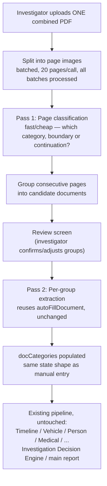

# Document Intake Pipeline — Architecture Assessment

**Status: Proposal. Not approved, not implemented, no code written.** This document is research and design only, per explicit instruction. It feeds into (does not replace) the frozen [Legal & Investigation Intelligence Engine](../legal-intelligence/README.md) — everything from "Chronological timeline" onward in the proposed pipeline already exists and is untouched by anything in this document.

## 1. Problem Statement

**Today**: an investigator manually ticks each of **36 document categories** in `report.html`, and per category either types values directly or clicks "Upload to auto-fill" to extract fields from files scoped to *that one category*. For a full MACT case (FIR, panchnama, DAR, PM report, MLC, discharge summary, medical bills, RC, permit, fitness, policy, statements, chargesheet...), this means dozens of individual upload actions.

**Proposed**: upload **one combined PDF** — the entire case file bundle as it typically arrives (a single scan from the field) — and have the system:
1. Identify where one document ends and the next begins within the bundle.
2. Group pages into individual documents.
3. Classify each group against the 36 known categories.
4. Extract fields per group (reusing today's per-category extraction).
5. Populate `docCategories` state automatically — ticking categories, filling values — exactly as if the investigator had done each upload by hand.

Everything downstream — Timeline Intelligence, the 5 cross-verification modules, Investigator Alerts, Risk Assessment, the Investigation Decision Engine, the main narrative report — reads from `docCategories`/`docsText` exactly as it does today. **This proposal only concerns what fills that state, not anything that reads from it.**

## 2. Current System Touchpoints (what this builds on, verified by direct code read)

| Existing piece | Location | Relevance |
|---|---|---|
| `DOC_CATEGORIES` | `report.html` | 36 categories, each with a `key`, `title`, and field list — the classification target set. |
| `_pdfFileToImages(file)` | `js/ai-service.js` | PDF → JPEG image array. **Already silently caps at 20 pages per file** — see §5, the critical constraint this proposal must resolve. |
| `_filesToPayload(files)` | `js/ai-service.js` | Combines images across files, **throws if the combined total exceeds 20 images**, and if total size exceeds ~18MB. |
| `_buildDocumentAutoFillPrompt(category, textBlock)` | `js/ai-service.js` | Per-category field extraction prompt — this is exactly what should run *after* grouping/classification, unchanged. |
| `AIService.autoFillDocument({category, files})` | `js/ai-service.js` | The extraction call this proposal would invoke once per identified document group, reused as-is. |

**Nothing above needs to change in behavior for existing per-category upload** — this proposal adds a new, separate entry point; it does not modify how a single-category upload works today.

## 3. The 20-Page Constraint — Why It's the Central Problem, Not a Detail

`_pdfFileToImages` does `Math.min(pdf.numPages, 20)` — **a 25-page PDF today silently processes only its first 20 pages, with no error, no warning, no indication to the investigator that content was dropped.** This is invisible today because per-category uploads are naturally small (a single FIR or single policy document rarely exceeds a few pages). A **combined case bundle** — the entire premise of this proposal — will routinely exceed 20 pages: FIR (2–3) + panchnama (2–3) + DAR (3–5) + site map (1–2) + PM report (3–5) + MLC (2–3) + discharge summary (2–4) + medical bills (highly variable, sometimes 10+) + RC/permit/fitness/policy (1–2 each) + multiple statements (2–4 each) + chargesheet (3–6) can easily total 40–80+ pages.

**This means the current silent-truncation behavior is not an edge case for this feature — it is the normal case.** Any implementation of this proposal must either (a) process the bundle in batches across multiple calls, or (b) fail loudly and specifically ("this bundle has 63 pages, only page-batches of 20 can be processed at a time") rather than inherit the current silent drop. Silently discarding pages 21+ of a real case bundle would be a serious, investigator-invisible data-loss bug — directly contrary to this whole system's "never fabricate, never silently drop information" standard already established across every Legal Intelligence module.

## 4. Proposed Pipeline (mapped to the submitted diagram)

Stage-by-stage:

1. **Split into page images** — reuse `_pdfFileToImages`'s per-page rendering, but loop across the *whole* PDF in batches of 20, not just the first 20 (§5).
2. **Pass 1 — Page classification.** For each page (or a small sliding window, to catch multi-page documents), ask a vision model: "which of these 36 categories does this page belong to, or is it a continuation of the previous page's document, or unrecognized?" Cheap, `model_tier: "fast"`, small output per page — this is a classification task, not extraction.
3. **Group consecutive pages** into candidate documents — client-side logic, no AI call, just merging adjacent same-category/continuation pages into ranges.
4. **Review screen — investigator confirms.** **Not optional.** Every other AI-generated result in this system stops at `"Pending Verification"` pending human review; a mis-grouped page range is a worse failure mode than a wrong field value (it could silently attribute the FIR's content to the panchnama category, for instance) and must not auto-commit. The investigator sees a simple list ("Pages 1–3: FIR Details [confidence: high]", "Pages 4–6: Spot Panchnama [confidence: medium]", "Page 19: Unrecognized"), can re-assign or split/merge groups, then confirms.
5. **Pass 2 — Per-group extraction.** Once confirmed, run the *existing, unmodified* `AIService.autoFillDocument` once per group, exactly as today's manual "Upload to auto-fill" does — this is where zero new extraction logic is needed.
6. **Populate `docCategories`.** Same state shape, same `mergeFieldValues` merge logic already used by manual auto-fill — ticks `include: true` for every category with a confirmed group, fills `values` from Pass 2.
7. **Everything after this point is unchanged** — the existing, frozen Legal Intelligence pipeline consumes `docCategories`/`docsText` exactly as it does when populated manually.

## 5. Resolving the Page-Count Problem

**Recommendation: process the full bundle in sequential batches of 20 pages, not a single call.** For an ~80-page bundle, that's 4 batches for Pass 1 classification. This is a real, new cost/latency dimension (§7) but the alternative — silent truncation or an arbitrary hard cap that rejects real case bundles — is not acceptable for a feature whose entire premise is "handle the whole bundle."

**Also recommended**: keep an explicit, visible page-count ceiling (e.g., 150 pages) that produces a clear, actionable error ("this bundle is too large to process automatically — split it into two uploads") rather than attempting unbounded batching — matches the existing pattern of `_filesToPayload`'s explicit size/count errors, just raised to bundle scale instead of per-category scale.

## 6. Technical Approach Options Considered

| Option | Description | Verdict |
|---|---|---|
| **A — Vision-only classification** | Send each page image directly to a vision call asking for category + boundary signal. | **Recommended baseline.** Reuses the exact infrastructure (`_pdfFileToImages`, vision endpoint) already proven for extraction; no new pipeline stage type. |
| **B — OCR-first, text classification** | Extract raw text per page first, classify from text (cheaper/faster than vision per page), only re-visit vision for genuinely ambiguous pages. | Worth prototyping as a cost optimization *after* Option A works, not as the first build — adds a pipeline stage and a second cheap-vs-accurate tradeoff to reason about before there's any real usage data to justify it. |
| **C — Fully automatic, no review screen** | Skip step 4 (investigator confirmation) — auto-populate `docCategories` directly. | **Rejected.** Contradicts this system's established, deliberate design principle (every other AI output stops at "Pending Verification" for human review) and risks silently misattributing an entire document's content to the wrong category — a materially worse failure mode than anything the 12 Legal Intelligence modules can produce, since those only ever add a *finding*, never silently relabel source data. |

## 7. Cost and Performance Estimate

Rough, for an ~80-page bundle (a large but realistic full case file):

- **Pass 1 (classification)**: ~80 pages ÷ 20/batch = 4 vision calls, `model_tier: "fast"` (Haiku), small output per call. Materially cheaper than Pass 2, since classification output is a few words per page, not full field extraction.
- **Pass 2 (extraction)**: one call per *confirmed document group* (likely 10–20 groups for a full case) — **this is exactly the same cost as today's manual per-category "Upload to auto-fill," just triggered automatically instead of by hand.** No new cost category here, only a new trigger mechanism.
- **Net new cost**: essentially just Pass 1 (classification) — a few extra `"fast"`-tier calls per bundle upload. Small relative to Pass 2 and negligible relative to the main report's Opus-tier generation cost.
- **Latency**: Pass 1's batches are naturally sequential (each depends on nothing from the others, so they *could* run concurrently, bounded by the same considerations as the Legal Intelligence Engine's own `Promise.all` pattern) — a few seconds per batch, likely 15–30s total for classification on a large bundle, before the investigator even reaches the review screen. Pass 2 (extraction) latency is unchanged from today's per-category behavior.

## 8. Error Handling and Ambiguous Cases

- **Unrecognized page** → explicit `"Unrecognized"` bucket in the review screen, never force-fit into the nearest category. Matches "never fabricate."
- **Low-confidence boundary** (page could be a continuation or a new document) → surfaced with its confidence in the review screen, not silently resolved either way.
- **A category appears twice in the bundle** (e.g., two separate witness statements) → both groups appear in the review screen; existing `mergeFieldValues` logic (already used when auto-fill runs twice on the same category) handles combining them into that category's `values`, unchanged.
- **Bundle exceeds the page ceiling** (§5) → explicit rejection with guidance, not a partial silent process.
- **A page vision cannot classify with any confidence** (blank, corrupted, illegible) → `"Unrecognized"`, same as a genuinely novel document type — the system cannot and should not distinguish "illegible" from "not one of our 36 categories" without guessing.

## 9. UI/UX Flow (proposal, not implementation)

- A new action, "Upload combined case file," alongside (not replacing) the existing per-category "Upload to auto-fill" controls — manual, per-category entry remains fully available as the fallback/override path it already is.
- After Pass 1 + grouping: a review screen (new UI surface) listing each candidate document (page range, proposed category, confidence), with controls to reassign, split, or merge groups, plus a per-item and bundle-wide "Unrecognized" state.
- Confirmation triggers Pass 2 exactly as if the investigator had clicked "Upload to auto-fill" once per confirmed group — reusing the existing loading/error UI states already built for that action, not new ones.
- No change to how the right-hand report preview or any Legal Intelligence module renders — they never know whether `docCategories` was populated by hand or by this pipeline.

## 10. What This Does Not Change

- The Legal & Investigation Intelligence Engine (registry, contract, all 13 modules, renderer, exports) — zero touchpoints. This proposal only concerns *how `docCategories` gets filled*, which is entirely upstream.
- `js/ai-service.js`'s existing public methods (`autoFillDocument`, `autoFillCaseHeader`, `generateReport`, `generateAccidentDiagram`, `getLegalIntelligence`) — all reused, none modified.
- The database schema — no new table/column is implied by anything in this proposal; `docCategories`/`legal_intelligence` already persist exactly as today.

## 11. What Would Be Genuinely New (if approved)

- A new `AIService` method, e.g. `classifyDocumentBundle({files}, {onStatus})` — Pass 1 + grouping logic.
- A new prompt builder for page classification (36-category, boundary-aware) — distinct from, but modeled on, the existing per-category extraction prompts.
- A new UI surface in `report.html` — the upload control and the review/confirm screen. This is the one place this proposal touches the renderer, and it's additive (a new screen), not a change to any existing component.
- Batch orchestration logic for bundles over 20 pages (§5).

## 12. Risks

| Risk | Mitigation |
|---|---|
| Silent page loss on large bundles | §5 — explicit batching + explicit ceiling, no inherited silent truncation |
| Misclassified document silently corrupts a category's data | §4 step 4 — mandatory review/confirm screen, never auto-commit |
| Cost creep on very large bundles | §5 ceiling + §7 estimate; classification cost is small relative to extraction, which is unchanged from today |
| Investigators bypass review by habit ("just click confirm") | UX design concern, not an engineering one — worth a deliberate design choice (e.g., requiring at least a glance at any `"Unrecognized"`/low-confidence item before confirming is enabled) if this proceeds |
| Feature creep into re-solving image forensics / authenticity | Explicitly out of scope, matching Digital Evidence Intelligence's own existing disclaimer — this pipeline classifies and extracts, it does not authenticate |

## 13. Recommended Phased Approach (if approved)

1. **Phase 1 — MVP within the existing 20-page ceiling.** Prove the classification + grouping + review-screen UX on bundles that fit in one batch, before building multi-batch orchestration. De-risks the harder UX and classification-accuracy questions before adding the batching complexity.
2. **Phase 2 — Multi-batch support** (§5), once Phase 1's classification accuracy is validated on real bundles.
3. **Phase 3 — Cost optimization** (Option B, §6), only if usage data justifies it.

## 14. Open Questions for Approval

1. Does the phased approach (§13) make sense, or should this go straight to full bundle-size support?
2. Is the mandatory review/confirm screen (§4, §6 Option C rejection) the right call, or is a "trust it, let me override after" flow preferred?
3. Any preference on the page ceiling number (§5's "e.g., 150" is a placeholder, not a researched figure)?

**No code will be written until this is approved.**
