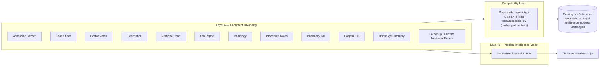
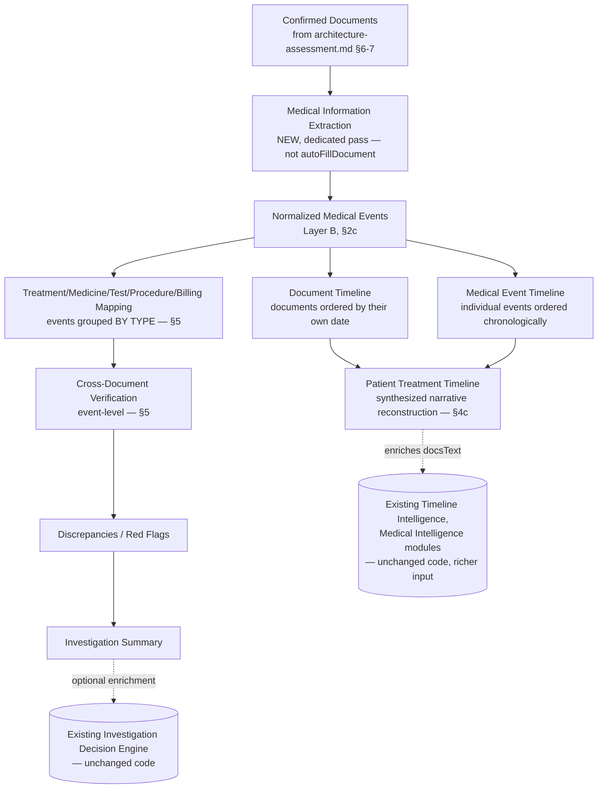

# Medical Intelligence Layer — Health-Claim Document Taxonomy, Normalized Events, and Treatment Timeline

**Status: Proposal. Not approved, not implemented, no code written.** Depends on [architecture-assessment.md](architecture-assessment.md) (the claim-type-agnostic intake mechanics) for confirmed documents as input. This document covers what happens *after* confirmation, specifically for medical-document-heavy claims.

## 1. Why This Is a Separate Document From the Intake Pipeline

The intake pipeline (page rendering, batching, classification, review, storage) is the same regardless of claim type. What happens with *confirmed* documents differs materially for medical content — a discharge summary isn't just "a category to fill in," it contains dozens of individually dated, individually sourced clinical facts (medicines, tests, procedures, billing line items) that a single flat category field can't hold apart. This document is that modeling work.

**Explicit instruction driving this design**: *"Do NOT make Treatment, Medicine, Test, Procedure and Billing separate document categories merely to achieve Health Claim intelligence. Treat these as investigation/intelligence dimensions derived from the confirmed source documents."* — i.e., these five things are not what gets classified in Pass 1; they're what gets *extracted and grouped* afterward.

## 2. Two-Layer Model



### 2a. Layer A — Document Taxonomy (what Pass 1 classifies against, for medical bundles)

The classification target set for medical documents, distinct from and finer-grained than the 4 coarse existing medical categories:

| Layer A type | Typical content |
|---|---|
| Admission Record | Admission date/time, presenting complaint, initial assessment |
| Case Sheet | Ongoing clinical record maintained during the stay |
| Doctor Notes | Physician observations, daily rounds |
| Prescription | Medicines prescribed, dosage, duration |
| Medicine Chart | Medicines actually administered, by date/time (distinct from *prescribed* — the gap between the two is itself a common verification point) |
| Lab Report | Test ordered, result, reference range |
| Radiology | Imaging study and findings |
| Procedure Notes | Surgical/procedural record |
| Pharmacy Bill | Itemized medicine billing |
| Hospital Bill | Itemized room/service/procedure billing |
| Discharge Summary | Course of treatment, diagnosis, condition at discharge |
| Follow-up / Current-Treatment Record | For claims where treatment is still ongoing at the time of investigation |

This list is a starting taxonomy, not exhaustive — it should be treated as extensible the same way the Legal Intelligence module registry is (§6 notes the parallel).

### 2b. Compatibility Layer (resolves risk 15.1 — no redesign of `docCategories`)

Each Layer-A document type maps to exactly one existing `DOC_CATEGORIES` key, so the frozen contract needs zero changes:

| Layer A type(s) | Maps to existing `docCategories` key |
|---|---|
| Admission Record, Case Sheet, Doctor Notes | `mlcMedical` |
| Discharge Summary | `dischargeSummary` |
| Prescription, Medicine Chart, Lab Report, Radiology, Procedure Notes, Pharmacy Bill, Hospital Bill | `medicalBills` (billing/clinical-detail items) or `mlcMedical` (clinical, non-billing items) — see open question §7.1 for exactly where the line falls |
| Follow-up / Current-Treatment Record | `mlcMedical`, with `asOf`-style dating for ongoing treatment (§4c) |

This is what "provide a compatibility layer" means concretely: a lookup table, not a schema change. `AIService.autoFillDocument` continues to run exactly as it does today, per confirmed group, writing into these existing category buckets — Medical Intelligence and every other existing module continue reading `docCategories`/`docsText` exactly as they always have, unaware that a richer taxonomy or a second extraction pass exists.

### 2c. Layer B — Normalized Medical Event Model

A **new, dedicated extraction pass, run after document confirmation, separate from and in addition to** the existing `autoFillDocument` call (per the explicit instruction: *"The Medical Timeline must NOT simply be an incidental side effect of autoFillDocument"*).

```json
{
  "eventId": "evt_0091",
  "eventType": "medicine | investigation | procedure | billingItem | diagnosis | treatment | clinicalStatus",
  "description": "Tab. Augmentin 625mg, twice daily",
  "date": "17/03/2026",
  "time": "09:00",
  "doctor": "Dr. R. Sharma",
  "facility": "City Hospital, Ahmedabad",
  "clinicalStatus": "stable",
  "amount": null,
  "sourceDocumentGroupId": "grp_0007",
  "sourcePage": 14,
  "confidence": "high"
}
```

- `date`/`time` preserved as written in source (same convention as every existing module's prompt — never reformatted at extraction time).
- `sourceDocumentGroupId` + `sourcePage` are the provenance requirement — *"each timeline event must retain source-document and page-level provenance so every finding can be traced back to evidence."* Every event traces to an exact confirmed group and an exact page within it.
- `amount` populated only for `billingItem` events; null otherwise — no field is force-filled.
- This is genuinely new structured data, stored separately from `docCategories` (§6 proposes where).

## 3. The Extended Pipeline (as specified)



## 4. Three-Tier Timeline Model

The explicit distinction required: **Document Timeline → Medical Event Timeline → Patient Treatment Timeline** are three different things, not three names for the same list.

### 4a. Document Timeline
Confirmed document *groups* (from the intake pipeline), ordered by each document's own date (e.g., admission record dated 15/03, discharge summary dated 22/03). Coarse — one point per document, not per clinical fact.

### 4b. Medical Event Timeline
Every individual Medical Event (§2c), ordered chronologically. One document (a medicine chart) can contribute many points to this timeline (one per administration), which is exactly the granularity the Document Timeline can't provide.

### 4c. Patient Treatment Timeline
The synthesized, report-facing reconstruction — the Medical Event Timeline organized into a coherent treatment narrative with explicit start/end anchors: **admission → diagnosis → treatment course (medicines/tests/procedures in sequence) → discharge**, or **admission → treatment course → "ongoing as of [latest confirmed record date]"** for claims where treatment is still active, per the explicit requirement to handle both cases. This is the artifact an investigator or the report actually reads — the other two tiers are its inputs, not separately-presented outputs (though both remain queryable for provenance/drill-down).

## 5. Treatment/Medicine/Test/Procedure/Billing Mapping and Cross-Document Verification

**Mapping**: Medical Events grouped by `eventType` — `{medicines: [...], investigations: [...], procedures: [...], billingItems: [...]}`. This is a view over Layer B, not new data.

**Cross-Document Verification (event-level)** — the genuinely new analytical capability this whole layer exists to enable, checking across these groups rather than across whole documents:
- Was every billed medicine actually documented as administered (medicine chart) or prescribed (prescription)?
- Was every billed test/procedure supported by a corresponding lab report/radiology/procedure note?
- Do billing dates align with the treatment dates they claim to bill for?

This is materially more precise than the *existing* Medical Intelligence module (which checks whether documents broadly agree — diagnosis wording, overall dates, disability percentage — not line-item medicine-by-medicine reconciliation). **It is a new capability, not a replacement of Medical Intelligence.**

**Discrepancy shape** (modeled on, but distinct from, the existing checks/discrepancies pattern — evidence-based, cites its sources, same discipline, different granularity):
```json
{
  "verificationId": "ver_0014",
  "type": "billed_not_administered",
  "description": "Injection X billed on 18/03 has no corresponding entry in the medicine chart for that date.",
  "severity": "high",
  "relatedEventIds": ["evt_0140", "evt_0141"]
}
```

**Investigation Summary**: a synthesis over the discrepancies + treatment timeline, in spirit identical to what the existing Investigation Decision Engine already does for the 12 Legal Intelligence modules (read other findings, cite sources, never invent). **Recommendation, not yet decided (§7.2)**: reuse that same synthesis pattern rather than building a second one from scratch.

## 6. How This Surfaces — Recommended Design

Two things happen with this layer's output, not one, satisfying both "build the dedicated new capability" and "don't replace the existing modules":

1. **New, dedicated data**: Medical Events, the three-tier timeline, and event-level verification findings are stored as their own structured data (§ open question in architecture-assessment.md — likely a new table/column, additive only, same non-destructive pattern as every other extension in this project) and available to a **new, dedicated report view** ("Patient Treatment Timeline") — a genuinely new capability, not hidden inside existing modules.
2. **Enrichment of existing modules, unchanged code**: the Patient Treatment Timeline and verification findings are *also* serialized into the `docsText` a health-claim draft sends to the existing `getLegalIntelligence()` call. Timeline Intelligence's existing prompt already asks for "every explicitly dated event" — richer, structured, provenance-tagged input makes its *existing, unmodified* logic produce a materially better result. Same for Medical Intelligence. **Zero code changes to either module** — this is enrichment of their input, not a rewrite of their behavior, which is exactly the "don't replace existing modules" instruction applied as literally as possible.

This mirrors the registry-based extensibility already proven for the 13-module Legal Intelligence Engine: a new capability plugs in by producing better input, not by modifying what already works.

## 7. Remaining Open Questions

### 7.1 Where Prescription/Medicine Chart/Lab Report/etc. land in the compatibility map
§2b proposes routing these to either `medicalBills` or `mlcMedical` and flags it as unresolved — this affects what today's *existing* Medical Intelligence prompt sees as its raw input text, so the exact split is worth a deliberate decision, not a default.

### 7.2 Does the Investigation Summary (§5) reuse the Investigation Decision Engine's pattern, or is it a new synthesis step?
Recommended (§5) but not yet decided: literally reusing that pattern (same second-pass-dispatch shape, applied to Medical Event findings instead of the 12 module records) versus building a distinct synthesis mechanism for this layer specifically.

### 7.3 `report.html` has no "Health Claim" claim type today
Confirmed by direct code read: the claim-type dropdown currently offers only `["MACT Death Claim", "MACT Injury Claim", "TPPD Claim"]` — no "Health Claim" option exists, even though the broader KEY Investigations platform's `claim_types` table already includes `health` as a type. This layer is claim-type-agnostic in principle (a MACT injury claim also has medical documents and would benefit from it too), but if "Health Claim" is meant to become its own first-class investigation type with a dedicated report structure, that's a larger product decision beyond this document's scope — worth naming explicitly rather than silently assuming either way.

### 7.4 Storage location for Medical Events (§2c)
Needs the same additive-schema treatment as everything else in this project (new table or new jsonb column, never altering `report_drafts`' existing columns) — not yet designed at the column/table level, deferred pending resolution of §7.1–7.3, since those affect what actually needs to be stored.

---

**No code will be written until this document's and [architecture-assessment.md](architecture-assessment.md)'s open items are addressed or explicitly deferred.**
