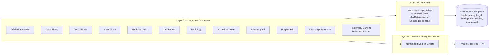
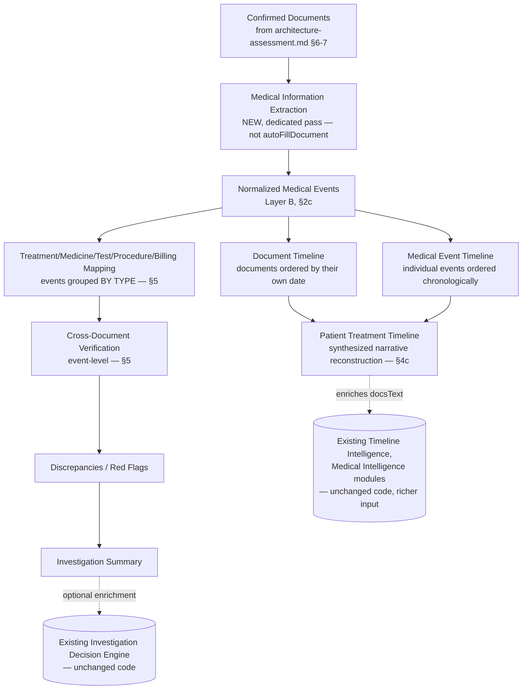

# Medical Intelligence Layer — Health-Claim Document Taxonomy, Normalized Events, and Treatment Timeline

**Status: Proposal, revised once. Not approved, not implemented, no code written.** Depends on [architecture-assessment.md](architecture-assessment.md) (the claim-type-agnostic intake mechanics) for confirmed documents as input. This document covers what happens *after* confirmation, specifically for medical-document-heavy claims.

**Revision history**: v1 (initial two-layer model) → **v2, this version** (all four §7 open questions resolved against the actual current codebase — compatibility map, Investigation Summary reuse, claim-type deferral, persistence design — plus a new relationship-graph model for the Medical Event layer, added per an explicit architecture check). Every resolution below was checked against the real current code (`report.html`, `js/ai-service.js`) and a live probe of the real Supabase project, not assumed — see inline citations.

## 1. Why This Is a Separate Document From the Intake Pipeline

The intake pipeline (page rendering, batching, classification, review, storage) is the same regardless of claim type. What happens with *confirmed* documents differs materially for medical content — a discharge summary isn't just "a category to fill in," it contains dozens of individually dated, individually sourced clinical facts (medicines, tests, procedures, billing line items) that a single flat category field can't hold apart. This document is that modeling work.

**Explicit instruction driving this design**: *"Do NOT make Treatment, Medicine, Test, Procedure and Billing separate document categories merely to achieve Health Claim intelligence. Treat these as investigation/intelligence dimensions derived from the confirmed source documents."* — i.e., these five things are not what gets classified in Pass 1; they're what gets *extracted and grouped* afterward.

## 2. Two-Layer Model



### 2a. Layer A — Document Taxonomy (what Pass 1 classifies against, for medical bundles)

The classification target set for medical documents, distinct from and finer-grained than the 4 coarse existing medical categories:

| Layer A type | Typical content |
|---|---|
| Admission Record | Admission date/time, presenting complaint, initial assessment |
| Case Sheet | Ongoing clinical record maintained during the stay |
| Doctor Notes | Physician observations, daily rounds |
| Prescription | Medicines prescribed, dosage, duration |
| Medicine Chart | Medicines actually administered, by date/time (distinct from *prescribed* — the gap between the two is itself a common verification point) |
| Lab Report | Test ordered, result, reference range |
| Radiology | Imaging study and findings |
| Procedure Notes | Surgical/procedural record |
| Pharmacy Bill | Itemized medicine billing |
| Hospital Bill | Itemized room/service/procedure billing |
| Discharge Summary | Course of treatment, diagnosis, condition at discharge |
| Follow-up / Current-Treatment Record | For claims where treatment is still ongoing at the time of investigation |

This list is a starting taxonomy, not exhaustive — it should be treated as extensible the same way the Legal Intelligence module registry is (§6 notes the parallel).

### 2b. Compatibility Layer — RESOLVED (was risk 15.1 / open question §7.1)

**Inspected directly, not guessed**: the actual current field lists for all 5 medical-adjacent `DOC_CATEGORIES` entries in `report.html` (lines 140–236), the current `_buildMedicalIntelligencePrompt` text (`js/ai-service.js:529–547`), and — critically — `buildDocsText()` (`report.html:373–381`), which is what every downstream module (Medical Intelligence, Timeline Intelligence, and indirectly the Investigation Decision Engine) actually reads. It serializes each included category as `--- {category.title} ---` followed by `{field.label}: {value}` lines. That serialization is the real constraint the mapping has to respect — it determines what section header and field vocabulary the existing prompts see, not just which bucket a value is stored in.

The 5 existing medical-adjacent categories and their exact fields:

| `docCategories` key | Fields | Shape |
|---|---|---|
| `mlcMedical` | hospital, admissionDate, dischargeDate, natureOfInjuries, narrative | Clinical/narrative |
| `dischargeSummary` | hospital, admissionDate, dischargeDate, diagnosis, treatment, conditionAtDischarge, narrative, remarks | Clinical/narrative |
| `medicalBills` | hospitalName, totalAmount, billsPeriod, billBreakdown, ambulanceCharges, followUpCosts, narrative, remarks | **Billing** — every non-narrative field is a money/amount/period fact |
| `disabilityCert` | certificateNo, issuedBy, disabilityPercentage, disabilityType, bodyPart, narrative, remarks | MACT-specific, not part of Layer A |
| `pmReport` | dateTime, causeOfDeath, narrative | MACT-specific, not part of Layer A |

`disabilityCert` and `pmReport` are MACT-death/injury-specific, not general health-claim taxonomy — they're outside Layer A's scope and unaffected by this map.

Looking at the actual field shapes resolves the original either/or ambiguity: **`medicalBills`'s fields are uniformly billing-shaped** (amount, period, breakdown, charges) — there is no field there that fits a lab result, a medicine list, or a clinical note. The honest, evidence-based split is therefore binary — billing fact vs. non-billing fact — not "billing vs. clinical-detail" as originally framed:

| Layer A type(s) | Maps to existing `docCategories` key | Why |
|---|---|---|
| Admission Record, Case Sheet, Doctor Notes | `mlcMedical` → `narrative` | Clinical narrative; `hospital`/`admissionDate`/`dischargeDate` fit Admission Record directly, the rest falls to `narrative` (no dedicated field exists for ongoing clinical notes anywhere in the current contract) |
| Prescription | `mlcMedical` → `narrative` | **Deliberately not `medicalBills`** — prescribed-but-not-yet-billed is a clinical fact, not a billing fact. Keeping it out of the billing bucket is what preserves the *prescribed vs. billed* distinction the existing coarse contract can express at all |
| Medicine Chart | `mlcMedical` → `narrative` | Administered medicine is also clinical, not billing — same reasoning, and keeps it distinct from Prescription's *source group* even though both land in the same category (distinctness of prescribed vs. administered is preserved at the Layer B event level, §2c, not by the coarse category) |
| Lab Report, Radiology, Procedure Notes | `mlcMedical` → `narrative` | Clinical findings; no billing amount involved |
| Pharmacy Bill, Hospital Bill | `medicalBills` → `billBreakdown` / `totalAmount` / `billsPeriod` | Genuinely billing-shaped — canonical fit |
| Discharge Summary | `dischargeSummary` | Exact 1:1 match; `diagnosis`/`treatment`/`conditionAtDischarge` fit discharge content directly |
| Follow-up / Current-Treatment Record | `mlcMedical` → `narrative` | Closest existing fit, but **named honestly as imperfect** — no existing category has an "ongoing treatment" concept. This is a real gap the compatibility layer papers over, not a clean match |

**Named limitation, not hidden**: because Admission Record, Case Sheet, Doctor Notes, Prescription, Medicine Chart, Lab Report, Radiology, Procedure Notes, and Follow-up records all collapse into the single `mlcMedical.narrative` free-text field, **the compatibility-mapped `docCategories` output alone cannot preserve which Layer-A type or which confirmed document group a given sentence of narrative came from once several such documents are merged in.** That provenance is not lost overall — it's carried by Layer B (§2c/§2d) instead, which is exactly why Layer B has to exist as separate, structured data rather than "the compatibility map is enough." Nothing here changes `DOC_CATEGORIES` or `_buildMedicalIntelligencePrompt` — this is a lookup used when writing into existing buckets, not a schema change.

`AIService.autoFillDocument` continues to run exactly as it does today, per confirmed group, writing into these existing category buckets — Medical Intelligence and every other existing module continue reading `docCategories`/`docsText` exactly as they always have, unaware that a richer taxonomy or a second extraction pass exists.

### 2c. Layer B — Normalized Medical Event Model (persistence design resolved — see §8)

A **new, dedicated extraction pass, run after document confirmation, separate from and in addition to** the existing `autoFillDocument` call (per the explicit instruction: *"The Medical Timeline must NOT simply be an incidental side effect of autoFillDocument"*).

```json
{
  "eventId": "evt_0091",
  "eventType": "diagnosis | investigation | treatment | medicine | procedure | clinicalProgress | billingItem | dischargeEvent | followUp",
  "description": "Tab. Augmentin 625mg, twice daily",
  "date": "17/03/2026",
  "time": "09:00",
  "doctor": "Dr. R. Sharma",
  "facility": "City Hospital, Ahmedabad",
  "clinicalStatus": "stable",
  "amount": null,
  "sourceDocumentGroupId": "grp_0007",
  "sourcePages": [14],
  "confidence": "high",
  "extractionStatus": "extracted"
}
```

Two changes from v1, both required by this round's resolutions:
- **`eventType` extended** from the original 6 values to the full 9-node chain named in the relationship-graph requirement (§2d) — `diagnosis`, `investigation`, `treatment`, `medicine`, `procedure`, `clinicalProgress`, `billingItem`, `dischargeEvent`, `followUp` — so every node in Diagnosis → Investigation/Test → Treatment → Medicine → Procedure → Clinical Progress → Billing → Discharge → Follow-up has a matching event type, not just the 6 the original draft happened to name.
- **`sourcePage` → `sourcePages` (array)**, per the explicit "source page(s)" plural requirement — a single clinical fact (e.g. one bill line item, or a lab panel reported across a spread) can legitimately span or repeat across more than one page. Singular was an unstated assumption; plural is what the source material actually needs.
- **`extractionStatus` added**: `"extracted" | "investigator_confirmed" | "investigator_edited" | "investigator_rejected"` — makes this event's place in the "AI proposes, human confirms" boundary explicit and checkable, matching the same boundary already enforced for `legal_intelligence` (a module never marks itself `"Completed"`) and for `intake_review_sessions` (nothing writes to `doc_categories` until `status = 'confirmed'`).

Unchanged from v1:
- `date`/`time` preserved as written in source (same convention as every existing module's prompt — never reformatted at extraction time).
- `sourceDocumentGroupId` + `sourcePages` are the provenance requirement — *"each timeline event must retain source-document and page-level provenance so every finding can be traced back to evidence."* Every event traces to an exact confirmed group and the exact page(s) within it.
- `amount` populated only for `billingItem` events; null otherwise — no field is force-filled.
- This is genuinely new structured data, stored separately from `docCategories` (§8 — persistence design, resolved this revision).

### 2d. Layer B — Relationship Graph (new this revision — resolves the additional architecture check)

**The Patient Treatment Timeline must be an evidence-linked clinical journey, not merely a sorted list of dates** — a flat, date-ordered list of Medical Events cannot express that a specific billing line item relates to a specific procedure, or that a specific medicine was given *for* a specific diagnosis. That requires edges between events, not just timestamps on them.

Relationships are modeled as a **separate structure from the events themselves** — not a single `parentEventId` column on each event — because the required chain is a graph, not a tree: one diagnosis commonly leads to multiple tests; one billing item can relate to both a procedure and a medicine; a discharge can follow multiple parallel treatment threads (e.g. an orthopedic issue and an unrelated infection treated in the same admission). A single parent pointer can only express one tree; real bundles routinely need more than one.

```json
{
  "linkId": "lnk_0037",
  "fromEventId": "evt_0091",
  "toEventId": "evt_0140",
  "relationshipType": "diagnosed_via | treated_with | medicated_with | procedure_for | progress_of | billed_as | discharged_after | followed_up_by",
  "confidence": "high",
  "evidence": "Medicine chart entry for Augmentin (17/03) cites admission diagnosis of cellulitis on the same page range."
}
```

- `relationshipType` names the exact edges in the required chain (Diagnosis→Test→Treatment→Medicine→Procedure→Progress→Billing→Discharge→Follow-up).
- A link carries its **own** `confidence`, independent of either endpoint event's confidence — a relationship can be explicitly stated in the source or inferred from proximity/context, and those are not the same certainty.
- `evidence` is free text explaining why the link was drawn — same "every observation cites what it's based on" discipline already used for Pass 1b's seam evidence array (architecture-assessment.md §5a) and for every existing Legal Intelligence module.
- The Patient Treatment Timeline (§4c) becomes: Medical Events ordered by date, **traversed along these edges** to render the clinical narrative (e.g. "diagnosed with X → tested via Y → treated with Z → billed as W"), not just listed chronologically.

## 3. The Extended Pipeline (as specified)



## 4. Three-Tier Timeline Model

The explicit distinction required: **Document Timeline → Medical Event Timeline → Patient Treatment Timeline** are three different things, not three names for the same list.

### 4a. Document Timeline
Confirmed document *groups* (from the intake pipeline), ordered by each document's own date (e.g., admission record dated 15/03, discharge summary dated 22/03). Coarse — one point per document, not per clinical fact.

### 4b. Medical Event Timeline
Every individual Medical Event (§2c), ordered chronologically. One document (a medicine chart) can contribute many points to this timeline (one per administration), which is exactly the granularity the Document Timeline can't provide.

### 4c. Patient Treatment Timeline
The synthesized, report-facing reconstruction — the Medical Event Timeline organized into a coherent treatment narrative with explicit start/end anchors: **admission → diagnosis → treatment course (medicines/tests/procedures in sequence) → discharge**, or **admission → treatment course → "ongoing as of [latest confirmed record date]"** for claims where treatment is still active, per the explicit requirement to handle both cases. This is the artifact an investigator or the report actually reads — the other two tiers are its inputs, not separately-presented outputs (though both remain queryable for provenance/drill-down).

**Resolved this revision**: this is explicitly a **graph traversal, not a sorted list** — the narrative is built by walking the `relationshipType` edges from §2d in date order (diagnosis → its linked tests → its linked treatments → their linked medicines/procedures → linked billing → discharge/follow-up), so the rendered journey shows *why* events are connected, not only *when* they happened. An event with no edges at all (an orphan) is itself a signal worth surfacing to the investigator (see §5's missing-supporting-evidence check), not silently dropped from the narrative.

## 5. Treatment/Medicine/Test/Procedure/Billing Mapping and Cross-Document Verification

**Mapping**: Medical Events grouped by `eventType` — `{medicines: [...], investigations: [...], procedures: [...], billingItems: [...]}`. This is a view over Layer B, not new data.

**Cross-Document Verification (event-level)** — the genuinely new analytical capability this whole layer exists to enable, checking across these groups rather than across whole documents. **Resolved this revision**: the graph (§2d) plus per-event provenance is sufficient to support all 9 verification types named in the architecture check, none requiring new fields beyond what §2c/§2d already define:

| Verification type | How the schema supports it |
|---|---|
| Prescribed vs. billed | `medicine`-type events sourced from Prescription vs. `billingItem` events, joined via a `billed_as` edge; a medicine with no such edge is flaggable |
| Billed vs. administered/documented | Three-way comparison across `medicine` events sourced from Prescription (prescribed), Medicine Chart (administered), and `billingItem` (billed) — distinguishable because each retains its own `sourceDocumentGroupId` |
| Treatment vs. diagnosis | `treated_with` edges from a `diagnosis` event; a `treatment` event with no inbound edge is flaggable |
| Procedure vs. supporting record | `procedure_for` edges; a `procedure` event expects a linked `investigation` or `clinicalProgress` event as support |
| Medicine vs. treatment duration | Compare `date`/`time` spans of linked `medicine` events against their linked `treatment` event's own span |
| Duplicate/extra billing | Group `billingItem` events by (description, amount, date) within one investigation; multiple rows with distinct `sourcePages` is the signal |
| Date inconsistencies | Compare `date` across events joined by an edge (e.g. a `billed_as` edge where the billing event predates the medicine event it bills for) |
| Missing supporting evidence | An event with zero edges where the chain would normally expect one (e.g. a `procedure` with no `procedure_for` link) |
| Treatment-sequence inconsistencies | Walk `progress_of`/chain edges in date order; flag a sequence that violates expected ordering (e.g. a `dischargeEvent` dated before a `treatment` event it links to) |

This is materially more precise than the *existing* Medical Intelligence module (which checks whether documents broadly agree — diagnosis wording, overall dates, disability percentage — not line-item medicine-by-medicine reconciliation). **It is a new capability, not a replacement of Medical Intelligence.** This table describes what the persistence design (§8) makes *possible to compute*; the compute logic itself is a future module, not built in this round.

**Discrepancy shape** (modeled on, but distinct from, the existing checks/discrepancies pattern — evidence-based, cites its sources, same discipline, different granularity):
```json
{
  "verificationId": "ver_0014",
  "type": "billed_not_administered",
  "description": "Injection X billed on 18/03 has no corresponding entry in the medicine chart for that date.",
  "severity": "high",
  "relatedEventIds": ["evt_0140", "evt_0141"]
}
```
No field here or anywhere in §2c/§2d/§8 represents a fraud determination — `severity` is descriptive metadata on an observation ("high/medium/low"), not a verdict. This mirrors every existing module's discrepancy shape (e.g. Medical Intelligence's own `discrepancies[]`) exactly on purpose — evidence-based observations for the insurer/investigator to weigh, never automatic declarations.

**Investigation Summary — RESOLVED (was open question §7.2)**: does **not** reuse the pattern by becoming a second synthesis module. Reread against the actual `_computeInvestigationDecisionEngine` code (`js/ai-service.js:793–901`): it already loops `modules` generically — `_formatModulesForSynthesis` names zero specific `module_id`s, by design (its own comment: *"so a future 11th document-based module is included automatically"*) — so registering a second, separate synthesis module (e.g. `medicalInvestigationSummary`) would produce a **second, competing top-level conclusion** sitting next to the Decision Engine's own output. That is the "completely separate summary architecture" the instruction explicitly rejected, just wearing the same code shape.

The integration point is one layer earlier instead: Layer B's discrepancies and treatment-timeline findings become richer `docsText` input to the **existing, unmodified** `medicalIntelligence` and `timelineIntelligence` modules (already recommended in §6, item 2 below), and separately, their distilled findings populate those two modules' own `evidence`/`references` fields — fields that already exist, unmodified, in the frozen 12-field contract, e.g. `{label: "Injection X billed 18/03 — no matching medicine-chart entry", fileRef: "grp_0007 p.14"}`. Because the Decision Engine already reads every module's `summary`/`details`/`references` generically, richer Medical/Timeline Intelligence output flows into its synthesis automatically, on its very next run — **zero changes to `_computeInvestigationDecisionEngine`, `_formatModulesForSynthesis`, `_buildInvestigationDecisionEnginePrompt`, `_SYNTHESIS_MODULE_IMPLEMENTATIONS`, or `getLegalIntelligence`'s dispatch loop.** Medical-specific findings and full provenance are not lost in this compression — the complete Layer B graph with full `sourcePages`/`eventId`/edge detail still persists separately (§8) and drives its own dedicated "Patient Treatment Timeline" report view (§6), so the enrichment path feeds the existing synthesis a cited, distilled version while the full structured version remains independently queryable.

## 6. How This Surfaces — Recommended Design

Two things happen with this layer's output, not one, satisfying both "build the dedicated new capability" and "don't replace the existing modules":

1. **New, dedicated data**: Medical Events, the three-tier timeline, and event-level verification findings are stored as their own structured data — resolved this revision as the `medical_events` / `medical_event_links` tables, §8 below, additive only, same non-destructive pattern as every other extension in this project — and available to a **new, dedicated report view** ("Patient Treatment Timeline") — a genuinely new capability, not hidden inside existing modules.
2. **Enrichment of existing modules, unchanged code**: the Patient Treatment Timeline and verification findings are *also* serialized into the `docsText` a health-claim draft sends to the existing `getLegalIntelligence()` call. Timeline Intelligence's existing prompt already asks for "every explicitly dated event" — richer, structured, provenance-tagged input makes its *existing, unmodified* logic produce a materially better result. Same for Medical Intelligence. **Zero code changes to either module** — this is enrichment of their input, not a rewrite of their behavior, which is exactly the "don't replace existing modules" instruction applied as literally as possible.

This mirrors the registry-based extensibility already proven for the 13-module Legal Intelligence Engine: a new capability plugs in by producing better input, not by modifying what already works.

## 7. Resolution Log (was "Remaining Open Questions")

### 7.1 Where Prescription/Medicine Chart/Lab Report/etc. land in the compatibility map — RESOLVED, §2b
Binary split by whether the Layer-A type carries a billing fact, grounded in the actual field shapes of all 5 existing medical `docCategories` entries plus `buildDocsText()`'s serialization. See §2b for the full table and reasoning.

### 7.2 Does the Investigation Summary (§5) reuse the Investigation Decision Engine's pattern, or is it a new synthesis step? — RESOLVED, §5
Neither literally, nor a new synthesis step. Enrichment of Medical/Timeline Intelligence's own output (existing `evidence`/`references` fields) is the integration point — the Decision Engine already consumes it automatically, unmodified. See §5 for the full reasoning, grounded in the actual `_computeInvestigationDecisionEngine` code.

### 7.3 `report.html` has no "Health Claim" claim type today — DEFERRED (explicit decision, not an open question)
Confirmed by direct code read: the claim-type dropdown currently offers only `["MACT Death Claim", "MACT Injury Claim", "TPPD Claim"]` — no "Health Claim" option exists, even though the broader KEY Investigations platform's `claim_types` table already includes `health` as a type. **Explicit decision**: this layer stays claim-type-agnostic — it applies to any claim with medical documents (a MACT injury claim included), not gated behind a "Health Claim" type. Whether "Health Claim" becomes its own first-class investigation type with a dedicated report structure is a separate, larger product decision, out of scope here. `report.html`'s claim-type dropdown and behavior are not touched by this proposal.

### 7.4 Storage location for Medical Events (§2c) — RESOLVED, §8
`medical_events` / `medical_event_links`, two new additive tables. See §8 for the full schema.

## 8. Medical Event Persistence Design (resolved this revision)

**Requirement**: Medical Events must be persistable structured investigation data, not merely transient processing output — with event provenance, source document group, source page(s), confidence, extraction status, and auditability.

**Design choice — two relational tables, not a jsonb blob**: `intake_review_sessions` (architecture-assessment.md §6) is one evolving document edited as a whole, so a jsonb blob per session fits. Medical Events are architecturally different — a *collection* of discrete, individually-queryable facts (an investigator needs "all billing events over ₹X," "every event linked to diagnosis Y") — so one row per event is the right shape, same reasoning that already governs every other relational table in this schema (`claims`, `qc_reviews`, etc.). Relationships (§2d) need their own table rather than a `parentEventId` column, because the required chain is a graph, not a tree (see §2d for why).

```sql
-- illustrative shape, not a migration to run yet

medical_events
  id                     uuid primary key
  draft_id               uuid references report_drafts(id)              -- which investigation this belongs to (report_drafts.id confirmed to exist — report.html:386)
  review_session_id      uuid references intake_review_sessions(id)      -- nullable; which intake run produced it — nullable because a correction can in principle be added later outside a session
  event_type             text     -- 'diagnosis' | 'investigation' | 'treatment' | 'medicine' | 'procedure'
                                   -- | 'clinicalProgress' | 'billingItem' | 'dischargeEvent' | 'followUp'  (§2c)
  description            text
  event_date             text     -- preserved as written in source, never reformatted at extraction time (same convention as every existing prompt)
  event_time             text     -- nullable
  doctor                 text     -- nullable
  facility               text     -- nullable
  clinical_status        text     -- nullable
  amount                 numeric  -- nullable; populated only for billingItem events
  source_document_group_id text   -- references document_groups[].groupId inside intake_review_sessions.document_groups (a value reference, not a DB-level FK — that data lives in a jsonb column, not its own table)
  source_pages            int[]   -- plural — one fact can span/repeat across multiple pages
  confidence               text   -- 'high' | 'medium' | 'low'
  extraction_status        text   -- 'extracted' | 'investigator_confirmed' | 'investigator_edited' | 'investigator_rejected'
  superseded_by             uuid references medical_events(id)  -- nullable; corrections create a new row and point the old one here rather than mutating it in place — same "never silently overwrite" discipline already used for document field auto-fill merging and intake_review_sessions.edit_log
  created_at                timestamptz
  updated_at                timestamptz
  created_by                uuid references profiles(id)

medical_event_links
  id                 uuid primary key
  draft_id           uuid references report_drafts(id)   -- denormalized for RLS simplicity — scoped the same way every other table in this app is (SECURITY DEFINER helpers keyed off draft/user, not a join through events)
  from_event_id      uuid references medical_events(id)
  to_event_id        uuid references medical_events(id)
  relationship_type  text  -- 'diagnosed_via' | 'treated_with' | 'medicated_with' | 'procedure_for'
                            -- | 'progress_of' | 'billed_as' | 'discharged_after' | 'followed_up_by'  (§2d)
  confidence         text  -- independent of either endpoint event's own confidence
  evidence           text  -- nullable; why this link was drawn
  created_at         timestamptz
```

- **Auditability**: `extraction_status` + `superseded_by` gives a checkable history without a separate append-only log table — an event's current state is always one row, its history is the chain of `superseded_by` pointers, and nothing is ever destructively updated once `extraction_status` moves past `'extracted'`.
- **RLS**: same `SECURITY DEFINER` helper pattern already used for every table per this project's conventions (CLAUDE.md: *"All tables have RLS with SECURITY DEFINER helpers to avoid recursion"*) — scoped by `draft_id → report_drafts.user_id`, the same authorization boundary as everything else. Not a new pattern.
- **Additive only**: two new tables; zero changes to `report_drafts`, `intake_review_sessions`, or any existing table's columns.

---

**No code will be written until this document's and [architecture-assessment.md](architecture-assessment.md)'s open items are addressed or explicitly deferred — status as of this revision: all six items from the latest resolution round are addressed above; remaining prerequisites are listed in the chat response that accompanies this revision, not repeated here.**
