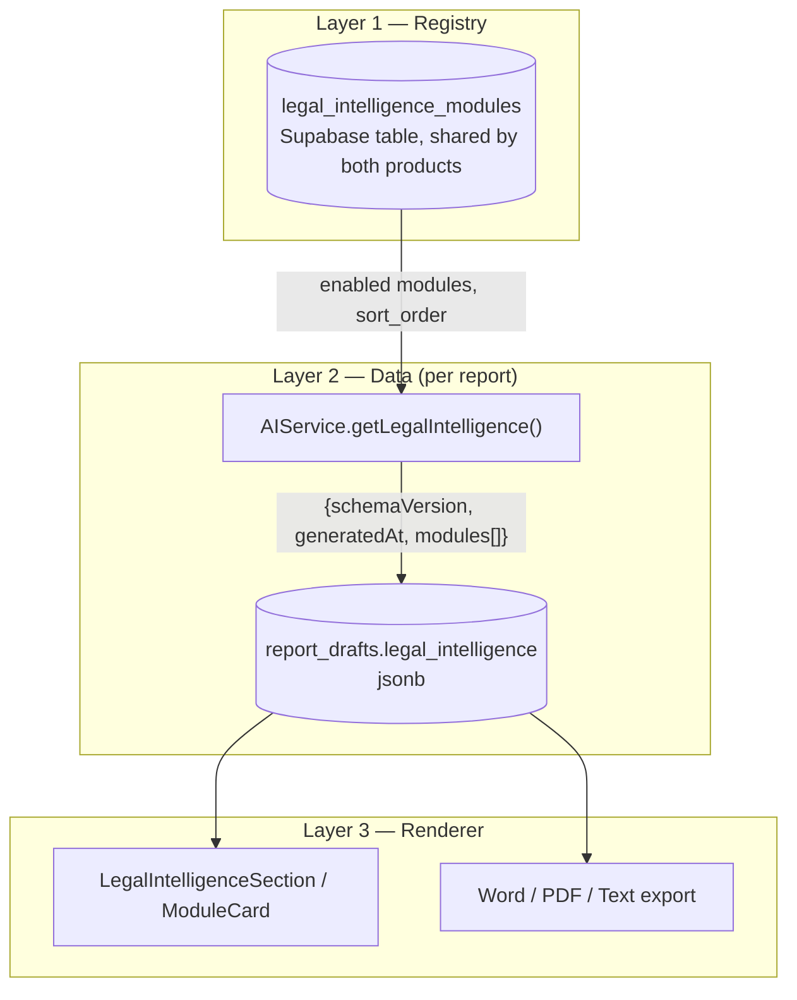

# Legal & Investigation Intelligence Engine — Architecture (v1.0)

**Status: Frozen.** This document describes the architecture as shipped in v1.0. Changes to anything described here require v1.1 planning, not incremental edits. **v1.1 added one module** (Investigation Decision Engine) via one deliberate, documented structural addition — see [§9](#9-v11-addition--investigation-decision-engine-synthesis-pass) at the end of this document. Everything above that section is exactly as it read at the v1.0 freeze.

## 1. What this is

A permanent, structured report section — "Legal & Investigation Intelligence" — shared between **KEY Investigations** (`report.html`) and the **Bima Anveshak AI Engine**, built on a plug-in architecture: new intelligence modules are added by registration, not by modifying existing code.

12 modules exist in the catalog. 9 are implemented (document-based, AI-driven). 3 are integration-ready but not implemented (require external, licensed/regulated data sources — see [Integration Specs](integrations/)).

## 2. The three-layer model



- **Layer 1 (Registry)** — the catalog of which modules *exist*: `module_id`, `module_label`, `sort_order`, `enabled`. Lives in `public.legal_intelligence_modules`, a plain Supabase table, public-read (same pattern as the pre-existing `claim_types` table). Adding a 13th module is one `INSERT`, zero file edits, zero deploys, in either product.
- **Layer 2 (Data)** — what was actually *found* for one report. An array of `ModuleRecord` objects (Section 4), stored in `report_drafts.legal_intelligence` (jsonb). Regenerated whenever an investigator clicks Refresh; persisted with the rest of the draft.
- **Layer 3 (Renderer)** — how any module's data is *displayed*: `ModuleCard`/`LegalIntelligenceSection` in `report.html`, and the export functions (`legalIntelligenceRowsHtml`, `legalIntelligenceTextLines`). Reads Layer 2 generically — **zero hardcoded module names anywhere in the renderer or exports**, verified by direct grep at every stage of this project. Never changes when Layer 1 gains a row.

Layer 1 and Layer 3 never change when a module is added. Only Layer 2's *content* changes, per report, per module.

## 3. Module dispatch (where module-specific logic lives)

`AIService.getLegalIntelligence({ caseData, docsText })` in `js/ai-service.js`:

1. Reads the registry (Layer 1).
2. For each enabled module, checks `_MODULE_IMPLEMENTATIONS[module_id]`.
3. If an implementation exists **and** `docsText` was provided, calls it. If it throws, catches the error, logs it, and falls back to a placeholder — one module's failure never affects another (verified by automated test at 9-module scale).
4. If no implementation exists (or no `docsText`), the module resolves as a placeholder (`status: "Not Performed"`).
5. Returns the full envelope (Section 4) regardless of how many modules were computed.

`docsText` absent (page load, new draft) → zero AI calls, zero cost. Real computation is opt-in, triggered only by the investigator clicking Refresh — the same pattern already used for accident-diagram generation.

```js
const _MODULE_IMPLEMENTATIONS = {
  timelineIntelligence: _computeTimelineIntelligence,
  vehicleIntelligence: _computeVehicleIntelligence,
  personIntelligence: _computePersonIntelligence,
  medicalIntelligence: _computeMedicalIntelligence,
  digitalEvidenceIntelligence: _computeDigitalEvidenceIntelligence,
  crossVerificationSummary: _computeCrossVerificationSummary,
  aiInvestigationFindings: _computeAIInvestigationFindings,
  riskAssessment: _computeRiskAssessment,
  investigatorAlerts: _computeInvestigatorAlerts,
  // courtCaseIntelligence, litigationIntelligence, insuranceIntelligence: not registered.
  // Registry rows exist; no implementation. Resolve as placeholders until integrated.
};
```

This map is **the entire extension seam**. Adding a module never touches the registry, the renderer, the exports, or any other module's implementation function.

## 4. The shared contract (frozen v1.1)

```json
{
  "schemaVersion": "1.1.0",
  "generatedAt": "<ISO 8601>",
  "modules": [
    {
      "moduleId": "timelineIntelligence",
      "moduleLabel": "Timeline Intelligence",
      "status": "Completed | Pending Verification | Not Performed | Not Applicable",
      "summary": "string | null",
      "details": "string | null",
      "confidence": "high | medium | low | null",
      "source": "string | null",
      "asOf": "<ISO 8601> | null",
      "verifiedBy": "string | null",
      "manualReview": false,
      "evidence": [{ "label": "string", "kind": "document|image|audio|video|map|link", "url|fileRef": "string" }],
      "references": ["string"],
      "lastUpdated": "<ISO 8601>",
      "version": 1
    }
  ]
}
```

- `schemaVersion` is envelope-level (the contract shape itself). `version` is per-record (that module's own data revision). They are independent counters.
- **Status vocabulary is exactly these 4 values, nothing else.** `manualReview`/`verifiedBy` record *who* moved a module from Pending to Completed — they are not a second status system. No module built in v1.0 ever sets `status: "Completed"` — that requires human sign-off, which is a v1.1+ workflow feature, not built yet.
- `evidence[].kind` is additive (introduced after the first two modules shipped); records without it default to `"document"` and remain valid.

## 5. Module catalog (v1.0)

| # | Module | Status | Scope |
|---|---|---|---|
| 1 | Timeline Intelligence | ✅ Implemented | Chronological event sequencing, impossible/inconsistent date flags |
| 2 | Vehicle Intelligence | ✅ Implemented | Registration/permit/fitness/policy cross-checks |
| 3 | Person Intelligence | ✅ Implemented | Identity/particulars consistency (name, age, address, relation) |
| 4 | Medical Intelligence | ✅ Implemented | Medical *documentation* consistency — never a clinical opinion |
| 5 | Digital Evidence Intelligence | ✅ Implemented | Text-described visual evidence completeness/consistency |
| 6 | Cross Verification Summary | ✅ Implemented | Incident *narrative* consistency (FIR/Panchnama/DAR/Site Map/Chargesheet) |
| 7 | AI Investigation Findings | ✅ Implemented | Evidence quality/reliability (corroborated vs. single-source) |
| 8 | Risk Assessment | ✅ Implemented | Document-evidenced risk level + factors |
| 9 | Investigator Alerts | ✅ Implemented | Missing/incomplete standard procedural items |
| 10 | Court Case Intelligence | 🔧 Integration-ready | External — see [spec](integrations/court-case-intelligence-spec.md) |
| 11 | Litigation Intelligence | 🔧 Integration-ready | External — see [spec](integrations/litigation-intelligence-spec.md) |
| 12 | Insurance Intelligence | 🔧 Integration-ready | External — see [spec](integrations/insurance-intelligence-spec.md) |

Modules 1–9 are grouped into two implementation patterns:

- **Timeline-style** (own response shape): Timeline Intelligence, AI Investigation Findings, Risk Assessment, Investigator Alerts — each has a response shape suited to its own question (events/anomalies; findings; riskLevel/factors; alerts).
- **Checks/discrepancies-style** (shared helper `_computeChecksAndDiscrepancies`): Vehicle, Person, Medical, Digital Evidence, Cross Verification Summary — all follow "cross-check documents pairwise, flag discrepancies," so they share one parser/formatter rather than duplicating it five times.

Full per-module detail: [Module Documentation](module-documentation.md).

## 6. Design principles (binding for all future modules)

1. **Every module is independent.** No shared mutable state; one module's failure (bad JSON, backend error, timeout) never affects another. Enforced by `try/catch` per module inside `Promise.all`, verified by automated test at full 9-module scale.
2. **Evidence-based only.** Every prompt explicitly instructs: report only what the text supports; if information is missing or unclear, say so — never guess or invent.
3. **Every observation cites its source document(s).** Enforced structurally — every check/discrepancy/finding/factor/alert carries a `source` (or, for Investigator Alerts, `checkedIn` — see [Module Documentation](module-documentation.md)) field, deduplicated into the record's `references`.
4. **No fabricated evidence.** Document-based modules honestly report `evidence: []` — there is no real file/URL behind pasted text. Only modules with genuine external evidence (future court-case/insurance lookups) populate `evidence` for real.
5. **Never `"Completed"` without human review.** All AI output starts at `"Pending Verification"`.
6. **No duplicate logic.** Shared shapes get a shared implementation (`_computeChecksAndDiscrepancies`). Distinct question → distinct scope, chosen deliberately to avoid overlapping with sibling modules or with the main narrative report's own findings/observations/conclusion.
7. **Renderer and exports are permanently generic.** No module name is ever hardcoded outside `_MODULE_IMPLEMENTATIONS` and the registry seed data. Verified by grep at every phase of this project.

## 7. Ownership roadmap (Rule: Bima Anveshak becomes the engine, KEY Investigations a client)

- **Phase A (current, v1.0)**: KEY Investigations computes modules client-side via `AIService.getLegalIntelligence()`, calling Bima Anveshak's existing `/ki/completion` endpoint directly. The registry is seeded once and shared via the same Supabase project.
- **Phase B (post v1.0 freeze on Bima Anveshak lifting)**: A real `POST /ki/intelligence` endpoint on Bima Anveshak (contract documented in `js/ai-service.js`, above `_MODULE_IMPLEMENTATIONS`) becomes the data source. Only `getLegalIntelligence()`'s body changes to a `_request("/ki/intelligence", ...)` call — no caller, no renderer, no export function changes.
- **Phase C (steady state)**: Bima Anveshak is the sole engine for both products. Adding a future module (Voice Intelligence, OSINT Intelligence, etc.) is a registry row plus a Bima Anveshak-side capability — KEY Investigations changes nothing to receive it.

## 8. What v1.0 deliberately does not include

- Court Case, Litigation, and Insurance Intelligence real implementations — integration-ready, not built (Section 5, and [integration specs](integrations/)).
- A manual-review workflow UI (setting `verifiedBy`/`manualReview`/moving a module to `"Completed"`) — the contract supports it; no UI exists to drive it yet.
- Cross-module data sharing (e.g., Risk Assessment reading Cross Verification Summary's output) — every module in v1.0 operates independently on `docsText` alone, by design (Section 6, principle 1).
- Rich-media evidence rendering (`evidence[]` with `kind: "audio"/"video"/"map"`) — the contract supports it; `ModuleCard` does not yet render `evidence` items at all (only `references`).

## 9. v1.1 addition — Investigation Decision Engine (synthesis pass)

Section 8 above named this exact gap: "Cross-module data sharing... every module in v1.0 operates independently on `docsText` alone, by design." The Investigation Decision Engine (module 13, `investigationDecisionEngine`) is the first module that needs the opposite — it must consume the *other* modules' resolved output and must never see `docsText` at all. Section 6's principle 1 (independence, no shared state) still holds for it in spirit: it doesn't mutate or depend on any module's *internal* state, only their finished, public `ModuleRecord` output, and its own failure still can't affect any other module (Design principle 1 is about failure isolation, which this preserves).

This could not be built as a 14th entry in `_MODULE_IMPLEMENTATIONS` (Section 3) without breaking that map's contract: every entry there is called with `{docsText}`, concurrently, inside one `Promise.all`, with no module ever seeing another's result. Handing a synthesis module `docsText` would be exactly the thing its own design must not do, and the concurrency means no module in that map could see a sibling's *resolved* output even if it wanted to — synthesis requires a genuine second pass, not a routine new entry (this was flagged, unprompted, in `v1.0-RELEASE-HANDOVER.md` §11 item 7 before this module existed).

**What actually changed** (all in `js/ai-service.js`):

- A second dispatch map, `_SYNTHESIS_MODULE_IMPLEMENTATIONS` — currently one entry, `investigationDecisionEngine`. Separate from `_MODULE_IMPLEMENTATIONS`, which is untouched.
- `getLegalIntelligence()` runs a second pass *after* its original `Promise.all` resolves: for each registry-enabled module_id found in `_SYNTHESIS_MODULE_IMPLEMENTATIONS`, it calls that module with `{ modules }` — the first pass's resolved array — and replaces that module's placeholder entry in place. Sequential (not `Promise.all`), in registry `sort_order`, so a *second* future synthesis module would see the first one's output too.
- Nothing else moved. Registry schema, the `report_drafts.legal_intelligence` column, `ModuleCard`, `LegalIntelligenceSection`, and both export functions are byte-for-byte unchanged (`git diff --stat report.html` is empty for this addition) — the module still returns an ordinary 14-field `ModuleRecord`, so Layer 3 renders it exactly like any other module without knowing anything special happened upstream.

**Why this doesn't weaken the independence guarantee**: `_MODULE_IMPLEMENTATIONS`'s 9 (and any future document-based) modules still run exactly as before — concurrent, isolated, `docsText`-only. The new second pass only ever *reads* their finished output; it cannot alter it, delay it, or fail into it (a `try/catch` around the second pass mirrors the first pass's per-module isolation). A document-based module added tomorrow needs zero awareness that a synthesis pass exists.

**Enforcement note, stated plainly rather than left implicit**: as with the rest of this contract (Section 4), "never reads raw documents" is enforced by the compute function's parameter shape (it is simply never given `docsText`) plus code review, not by a language-level module boundary — this is a plain browser script with no import isolation, same posture the whole engine already has. `tests/test-investigation-decision-engine.js` includes a test that captures the actual outbound prompt and asserts it never contains injected document text, so this is a tested property, not only a structural intention.

Full detail: [v1.1 Decision Engine Handover](v1.1-DECISION-ENGINE-HANDOVER.md).
