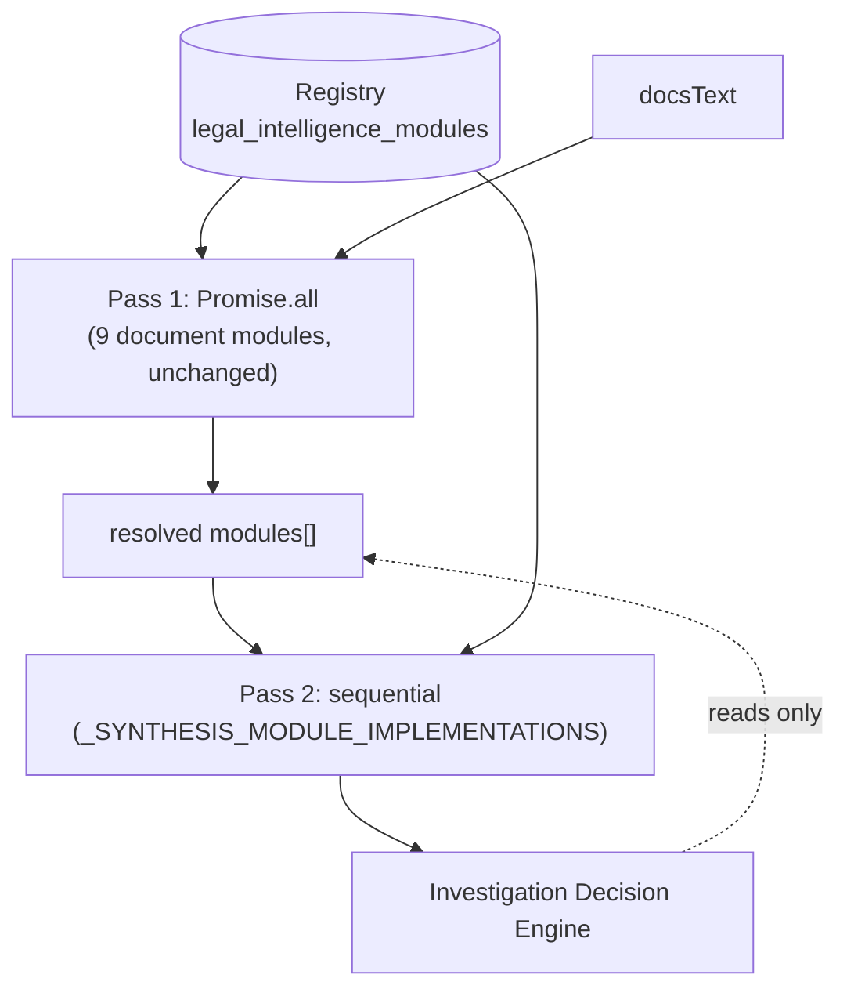

# Legal & Investigation Intelligence Engine — v1.1 Release Handover (Investigation Decision Engine)

Status: **COMPLETE** · Builds directly on `legal-intelligence-v1.0` · Same production-quality bar as v1.0, per explicit instruction.

This complements [`v1.0-RELEASE-HANDOVER.md`](v1.0-RELEASE-HANDOVER.md) — read that first if you haven't. This document covers only what changed for v1.1.

---

## 1. Release Summary

v1.0 shipped 9 independent, document-based intelligence modules, explicitly *not* attempting cross-module synthesis (`v1.0-RELEASE-HANDOVER.md` §11 item 7 named this as a future item requiring "its own design/approval pass"). v1.1 is that pass: one new module, **Investigation Decision Engine**, which reads the other modules' already-computed findings and produces one final investigation recommendation — executive summary, key findings, contradictions, missing evidence, recommendations, confidence, and a human-review flag — with every statement citing which module(s) support it.

**What shipped:**
- One new module (the 13th in the catalog), registered the same way every prior module was: one `INSERT` into `legal_intelligence_modules`.
- One deliberate, documented structural addition — a second dispatch pass in `getLegalIntelligence()` — because this module structurally cannot work the way the other 9 do (see [Architecture §9](architecture.md#9-v11-addition--investigation-decision-engine-synthesis-pass) for the full reasoning).
- **Zero changes** to the registry table schema, the `report_drafts.legal_intelligence` column, the `ModuleRecord` contract, `report.html` (renderer, exports, persistence), or any of the 9 existing modules' own code.
- The project's **first-ever committed test suite** (`tests/`) — closing the exact gap `v1.0-RELEASE-HANDOVER.md` §7 flagged ("test files live in session-scratch storage, not `keyinvestigations/`... should be formalized before v1.1 adds more modules"), using the pattern already designed and proven during v1.0, not a new invention.

**How it was verified**: 8 automated tests (the 7 cases `testing-guide.md` requires per module, plus one Decision-Engine-specific test), all passing, run via plain `node tests/test-investigation-decision-engine.js` — no build step, no framework, matching this project's constraints. `git diff --stat report.html` confirmed empty, the project's own standing regression check.

---

## 2. Final Project Tree — Files Added or Modified

| File | Change |
|---|---|
| `js/ai-service.js` | MODIFIED. Added `_formatModulesForSynthesis`, `_buildInvestigationDecisionEnginePrompt`, `_computeInvestigationDecisionEngine`, `_SYNTHESIS_MODULE_IMPLEMENTATIONS`. Extended `getLegalIntelligence()` with a second pass (~20 lines). `_MODULE_IMPLEMENTATIONS` and all 9 existing compute functions unchanged. |
| `supabase/migrations/20260721000001_investigation_decision_engine_module.sql` | NEW. One `INSERT` into the existing registry table. |
| `tests/vm-harness.js` | NEW. Reusable `vm`-sandbox test harness (first committed test infrastructure in this repo). |
| `tests/test-investigation-decision-engine.js` | NEW. 8 tests covering the Decision Engine. |
| `docs/legal-intelligence/architecture.md` | MODIFIED. Appended §9 documenting the second-pass design; a one-line pointer added near the top. All v1.0 sections (1–8) unedited. |
| `docs/legal-intelligence/module-documentation.md` | MODIFIED. Appended the module's entry (§13), after the existing 12. |
| `docs/legal-intelligence/v1.1-DECISION-ENGINE-HANDOVER.md` | NEW. This document. |

**Untouched**: `report.html`, `js/app.js`, `js/supabase.js`, every other page, every other migration, `supabase/migrations/20260719000001_legal_intelligence.sql`, `supabase/migrations/20260719000002_legal_intelligence_modules.sql` (the table this migration inserts into — no `ALTER` anywhere), and the `bima-anveshak-ai` repository.

---

## 3. Database Schema Summary

No schema change. One data row added to the existing `legal_intelligence_modules` table via migration (Section 2). `report_drafts.legal_intelligence` stores this module's record inside the same `modules[]` array as every other module — no new column, no new table.

---

## 4. API Summary

No new REST endpoint. The Decision Engine's AI call reuses the exact same `_request("/ki/completion", {...})` transport every existing module already uses (same auth, retry, and single-in-flight queueing) — just with a prompt built from other modules' output instead of `docsText`.

| Method | Backend call | Cost profile |
|---|---|---|
| `AIService.getLegalIntelligence({caseData, docsText})` | Now up to 10 concurrent-or-sequential `POST /ki/completion` calls (9 in the first pass's `Promise.all`, +1 in the second pass) | Zero extra cost if no other module has real data yet (short-circuits before calling AI) — otherwise one additional `"fast"`-tier call per Refresh |

---

## 5. Module Dependency Diagram (updated)

The 9 modules from v1.0 have zero new edges — they still cannot see each other, and now also cannot see the Decision Engine (which runs strictly after them). The Decision Engine is the only node with an inbound edge from `resolved modules[]` rather than from `docsText`.

---

## 6. Data Flow (what changed from v1.0 §6)

Same sequence as v1.0 through "`par up to 9 modules concurrently`." After that `par` block resolves, one more step is inserted before the envelope returns to the UI: the Decision Engine runs (skipped entirely, zero cost, if nothing else has real data), its result replaces its own placeholder entry in the `modules[]` array in place, then the full envelope (now up to 13 entries) returns exactly as before. Total added latency ≈ one more `"fast"`-tier call, only when at least one other module has real content.

---

## 7. Remaining Technical Debt

| Item | Detail | Severity |
|---|---|---|
| No UI distinction for the Decision Engine | Renders as a normal `ModuleCard`, same as any of the other 12 — no "final verdict" visual treatment. Deliberate for v1.1 (zero renderer risk, per the spec's explicit "no frontend architecture changes"); worth considering as a v1.2 UI-only enhancement if investigators want it visually distinguished. | Low |
| Single synthesis module, ordering rule untested in practice | `getLegalIntelligence()`'s second pass runs synthesis modules sequentially in `sort_order` so a second one could see the first's output — but there is only one today, so this specific behavior has no real test coverage yet, only the single-module path. | Low — revisit if/when a second synthesis-type module is proposed |
| Test suite covers this module only | `tests/` now exists, but the 9 v1.0 modules still have no committed regression tests of their own (same gap `v1.0-RELEASE-HANDOVER.md` §7 already flagged) — this handover closes the *infrastructure* gap (the harness now exists, reusable), not full coverage. | Medium — same severity v1.0 already assigned this |

---

## 8. Known Limitations

- **Depends entirely on the other modules' quality.** If a document-based module's own output is thin, wrong, or a placeholder, the Decision Engine's synthesis is correspondingly thin — it has no independent way to verify or improve on what it's given, by design (it never sees the source documents).
- **English-only, same as v1.0.** No new language capability introduced.
- **No manual-review workflow still.** `manualReview` can now be set `true` by this module for the first time, but there is still no UI to act on it (same v1.0 §8 limitation, now slightly more load-bearing since this is the first module to actually populate it as `true`).
- **AI output can be wrong**, same as every other module — `"Pending Verification"` status exists for the same reason it does everywhere else in this engine.

---

## 9. Security Considerations

No new surface. Same auth (Supabase JWT via the shared `_request` transport), same RLS posture (registry stays public-read, no sensitive data in the new row), same XSS protections (this module's `summary`/`details` flow through the exact same React escaping and `escapeHtml()` export path already tested for the other 9 in v1.0 — no `dangerouslySetInnerHTML` was added). No new data category sent to AI providers — the prompt contains only text already computed and stored by the other modules, which itself derives from `docsText` already sent to the same providers today.

---

## 10. Performance Considerations

- `model_tier: "fast"` (Haiku), same as every other module — this is a synthesis/formatting task, not long-form narrative writing.
- The zero-usable-modules short-circuit (Section 1) means idle/early-draft Refresh clicks cost nothing extra — the same "zero cost when idle" property v1.0 established still holds.
- `max_tokens: 2500` — slightly higher than the other modules' 1500–2000, since this one synthesises across potentially 9 inputs rather than reading one document set; still well under the main report's 16000.

---

## 11. Future Roadmap (recommendation only, not a commitment)

1. A "final verdict" visual treatment for the Decision Engine's card, distinguishing it from the input modules it summarises — pure UI, no schema/contract change needed.
2. Commit regression tests for the 9 v1.0 modules using the now-reusable `tests/vm-harness.js` — the harness exists specifically so this is now cheap to do incrementally, module by module.
3. Once a manual-review workflow UI exists (v1.0's own top roadmap item), extend it to let an investigator explicitly confirm or override the Decision Engine's `decisionStatus` — currently that text is AI-only and never marked reviewed by a human, same as every other module.
4. If/when Court Case, Litigation, or Insurance Intelligence ship, no Decision Engine change is needed — confirm this by re-running `tests/test-investigation-decision-engine.js` after any such module ships, expecting the "future modules automatically included" property to hold without a code change.

---

## 12. Risk Assessment for Future Changes

| Change type | Risk | Why |
|---|---|---|
| Add another document-based module | **Low** | Unchanged from v1.0 — proven 9 times, now 9 times still true; the Decision Engine will pick it up automatically next Refresh. |
| Add a second synthesis-type module | **Low–Medium** | The sequential, `sort_order`-based second pass was designed for this, but it has no real second example yet — re-verify the ordering behavior specifically when this happens. |
| Modify `_computeInvestigationDecisionEngine`'s prompt or response shape | **Low** | Isolated to this one module; the 9 document modules and the renderer are structurally incapable of being affected by it. |
| Modify `getLegalIntelligence()`'s dispatch logic itself (either pass) | **Medium** | Shared by all 13 modules now instead of 12 — re-run the full test suite (once it covers more than this one module) after any change here, not just this module's own tests. |
| Change any contract field | **High** | Unchanged from v1.0 — still a breaking change for whichever product isn't updated simultaneously. |

---

## 13. Backup and Recovery

No change from [v1.0 §13](v1.0-RELEASE-HANDOVER.md#13-backup-and-recovery-recommendations). The new registry row is fully reconstructible from `supabase/migrations/20260721000001_investigation_decision_engine_module.sql` alone, same recovery story as the original 12.

---

## 14. Deployment Checklist

- [ ] Code change committed with a clear message.
- [ ] `git diff --stat report.html` reviewed — empty (confirmed Section 1).
- [ ] `node tests/test-investigation-decision-engine.js` — all cases pass (confirmed Section 1).
- [ ] Pushed to `main`.
- [ ] Deployed `js/ai-service.js` fetched directly (cache-busted) and grepped for `_computeInvestigationDecisionEngine` to confirm production.
- [ ] Migration `20260721000001_investigation_decision_engine_module.sql` run manually via the Supabase SQL Editor (no migration auto-applies in this project), then the resulting row verified directly.
- [ ] Manually exercised in `report.html` against a real draft with at least 2-3 other modules populated, confirming the 13th `ModuleCard` renders and correctly cites its sources.

---

## 15. Final Production Readiness Checklist

| Item | Status |
|---|---|
| Structural design documented and reasoned (why a second pass, not a 10th `_MODULE_IMPLEMENTATIONS` entry) | ✅ |
| Investigation Decision Engine implemented | ✅ |
| Automated test coverage (8 tests, first committed suite in this repo) | ✅ |
| `report.html` / renderer / exports / registry schema / contract verified unchanged | ✅ |
| "Never reads raw documents" verified by a real test, not just asserted | ✅ |
| Zero-cost idle behavior preserved and tested | ✅ |
| Backward compatible with all 9 v1.0 modules | ✅ |
| Live deployment confirmed matching tested code | ⏳ Pending push (Section 14) |
| Manual in-browser verification against a real draft | ⏳ Pending (Section 14) |

**Verdict: v1.1 (Investigation Decision Engine) is complete pending the deployment and manual-verification steps in Section 14.** Everything code-level, tested, and reasoned about is done; what remains is the standard push-and-confirm practice this project already follows for every module.
